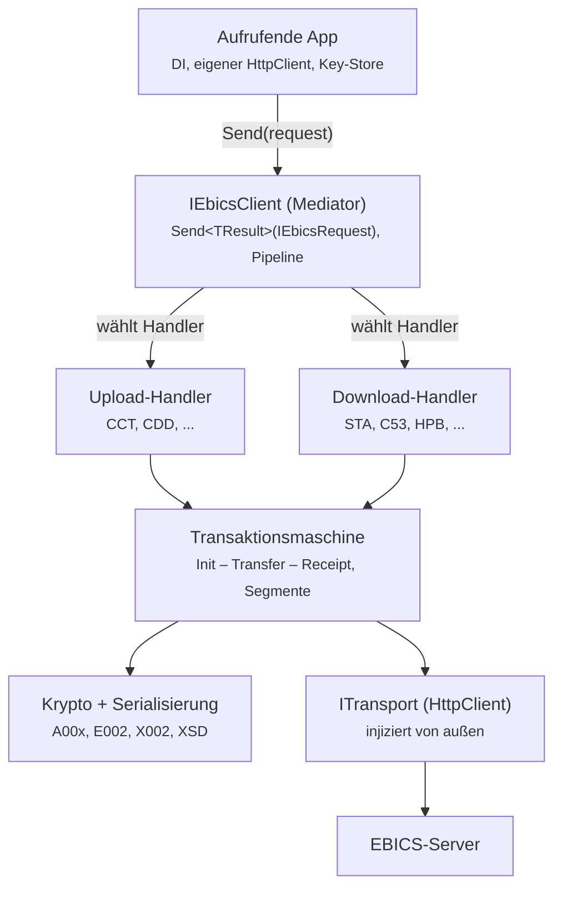
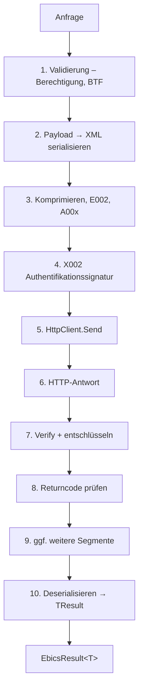
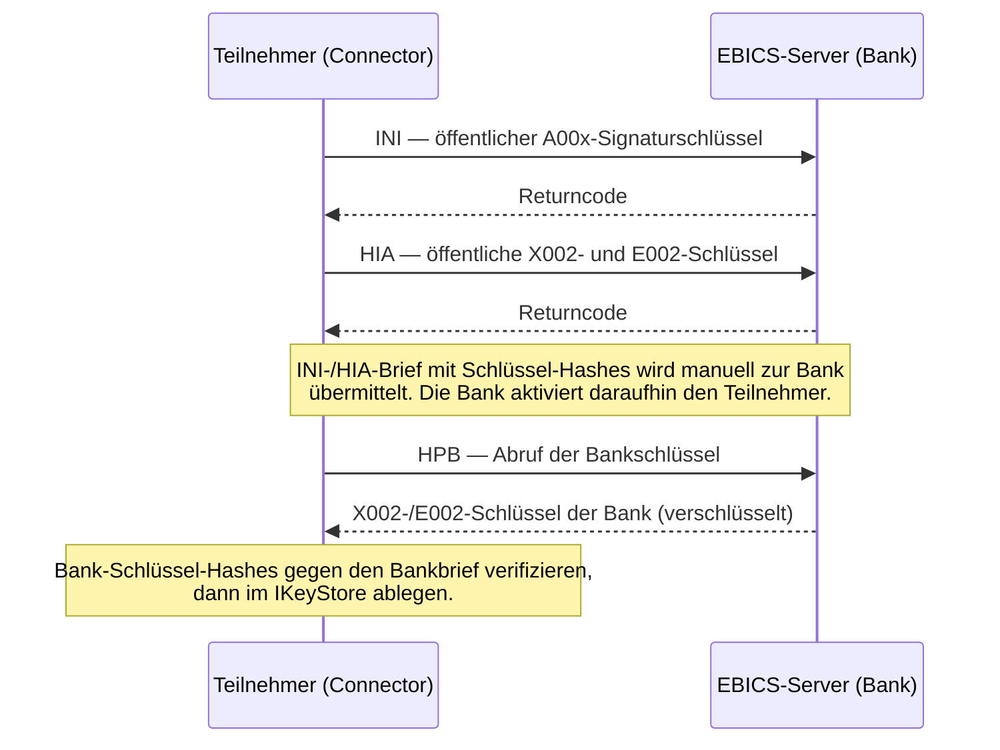
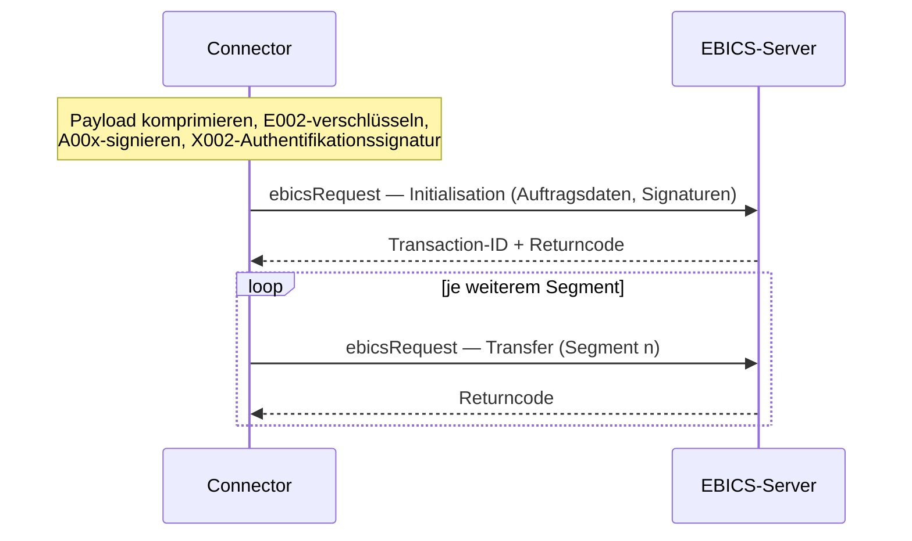
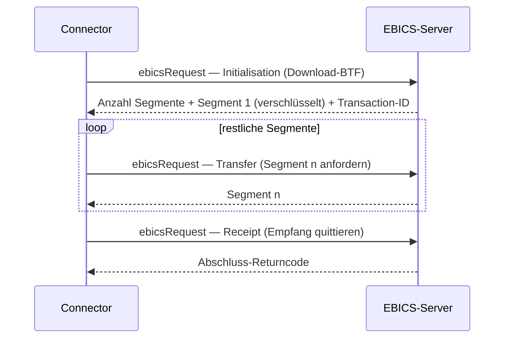

# EBICO.Connector — Architektur

`EBICO.Connector` ist die Client-Bibliothek für den Zugriff auf einen
EBICS-Server (den Emulator `EBICO.Server` oder eine echte Bank). Sie ist
fluent, testbar und DI-freundlich. Dieses Dokument beschreibt die tragende
Architektur und die wichtigsten Designentscheidungen samt Trade-offs.

> **Status:** Dieses Dokument beschreibt einen *begründeten Architektur-Vorschlag*
> für den noch nicht implementierten `EBICO.Connector` (Milestone M6). Ablaufdetails
> — etwa die Reihenfolge E002/A00x/X002 oder die Segmentschleife je Version — sind
> gegen die offiziellen EBICS-XSDs/Annexe zu verifizieren, sobald die Schemas
> vorliegen. Welche Bausteine bereits in `EBICO.Core` existieren und welche noch
> offen sind, steht im Abschnitt **„Bausteine: vorhanden vs. geplant"** weiter unten.

## Leitidee: Mediator-Muster

Der Aufrufer kennt nur **eine** Methode — `IEbicsClient.Send(request)`. Er
übergibt ein Request-Objekt und bekommt ein typisiertes Ergebnis zurück. Die
gesamte EBICS-Komplexität (Transaktions-Skelett, Kryptografie, XML-Serialisierung,
Transport) liegt darunter und ist für den Aufrufer unsichtbar.

```csharp
var result = await client.Send(new CddUploadRequest { Pain008 = bytes });
```

**Warum Mediator hier passt:** EBICS-Aufträge unterscheiden sich erstaunlich
wenig. Nahezu jeder Auftrag ist entweder ein *Upload* (Initialisation →
Transfer) oder ein *Download* (Initialisation → Transfer → Receipt) und
unterscheidet sich nur in OrderType/BTF, Richtung und Payload-Behandlung. Ein
generischer Handler pro Richtung deckt damit den Großteil ab; Sonderfälle
(HPB, INI/HIA) bekommen eigene Handler. Das ist dasselbe Muster, das MediatR
populär gemacht hat — hier aber bewusst ohne diese Library (siehe
[Designentscheidungen](#designentscheidungen) und
[ADR-0005](../adr/0005-connector-dispatch-ohne-mediatr.md)).

## Schichtenmodell



Von außen nach innen:

1. **Aufrufende App** — bringt Dependency Injection, einen eigenen
   `HttpClient` und einen Key-Store mit.
2. **`IEbicsClient` (Mediator)** — die einzige öffentliche Einstiegsmethode;
   schlägt anhand des Request-Typs den passenden Handler nach.
3. **Upload-/Download-Handler** — ein generischer Handler je Richtung plus
   Sonderfall-Handler (HPB, INI/HIA).
4. **Transaktionsmaschine** — kapselt das gemeinsame Init/Transfer/Receipt-
   Skelett samt Segmentierung.
5. **Krypto + Serialisierung** und **Transport** — die Querschnitts-Bausteine.
6. **EBICS-Server** — Gegenstelle (Emulator oder echt).

## Send-Pipeline

Jeder `Send`-Aufruf durchläuft eine Pipeline klar getrennter Stufen. Beispiel
für einen Upload; Schritte 9/10 sind die Download-Segmentschleife.



Jede Stufe ist eine eigene, isoliert unit-testbare Komponente. Die
Segmentschleife (9) ruft intern weiter, bis alle Segmente eines Downloads
vorliegen, und gibt erst dann das vollständige `TResult` zurück. Die konkrete
Ausprägung der Krypto-Stufen ist in eigenen Doku-Seiten beschrieben:
[XML-Serialisierung & C14N](../protocol/serialization-c14n.md),
[Verschlüsselung E002](../protocol/encryption-e002.md) und
[Banktechnische Signatur A005/A006](../protocol/bank-signature.md).

## Kern-Abstraktionen

```csharp
// Marker + Ergebnistyp-Bindung: Der Request "weiß", was er zurückgibt.
public interface IEbicsRequest<TResult> { }

// Der Mediator. Das ist alles, was die aufrufende App kennt.
public interface IEbicsClient
{
    Task<EbicsResult<TResult>> Send<TResult>(
        IEbicsRequest<TResult> request,
        CancellationToken ct = default);
}

// Beispiel-Request – nur Daten, keine Logik.
public sealed class CddUploadRequest : IEbicsRequest<UploadReceipt>
{
    public required ReadOnlyMemory<byte> Pain008 { get; init; }
}

// Ein Handler pro Request-Typ, vom Client nachgeschlagen.
public interface IEbicsRequestHandler<TRequest, TResult>
    where TRequest : IEbicsRequest<TResult>
{
    Task<EbicsResult<TResult>> Handle(
        TRequest request, EbicsContext ctx, CancellationToken ct);
}
```

Der Aufruf in der App bleibt dadurch trivial:

```csharp
var result = await client.Send(new CddUploadRequest { Pain008 = bytes });
```

> **Abgrenzung zu Core:** `IEbicsRequest<TResult>` ist die *app-seitige* Request-
> Abstraktion des Connectors. Sie ist bewusst von den protokollnahen
> Envelope-Schnittstellen in `EBICO.Core`
> (`IEbicsRequestEnvelope`/`IEbicsResponseEnvelope`, siehe
> [Versions-Dispatch](../protocol/version-dispatch.md)) getrennt — beide leben
> auf unterschiedlichen Schichten.

## Onboarding-Flows: INI / HIA / HPB

Bevor ein Teilnehmer fachliche Aufträge senden kann, muss der Schlüsselaustausch
abgeschlossen sein. Der Connector kapselt das in drei Sonderfall-Handlern; die
Schlüssel selbst kommen aus dem [`IKeyStore`](#key-store-als-abstraktion-ikeystore).



- **INI** überträgt den öffentlichen **A00x**-Signaturschlüssel des Teilnehmers
  (banktechnische Signatur, siehe [A005/A006](../protocol/bank-signature.md)).
- **HIA** überträgt den öffentlichen **X002**-Authentifikations- und den
  **E002**-Verschlüsselungsschlüssel des Teilnehmers.
- **HPB** ist ein *Download*: Der Teilnehmer holt die öffentlichen Bankschlüssel
  (X002/E002) und verifiziert deren Hash gegen den Bankbrief.

Erst nach INI + HIA + HPB und der Aktivierung durch die Bank sind Uploads (z. B.
CCT/CDD) und Downloads (z. B. STA/C53) möglich — das entspricht dem
Akzeptanzkriterium des Connector-Epics. Zu Schlüsselversionen und
-repräsentation siehe [Schlüsselpaare & -repräsentation](../protocol/key-representation.md).

## Transaktions-Skelett: Upload und Download

Alle fachlichen Aufträge teilen sich ein gemeinsames Transaktions-Skelett, das
die Transaktionsmaschine kapselt. Genau diese Gemeinsamkeit macht je einen
generischen Handler pro Richtung möglich.

### Upload (Initialisation → Transfer)



### Download (Initialisation → Transfer → Receipt)



Der Upload endet nach der Transfer-Phase; der Download quittiert zusätzlich mit
einer **Receipt**-Phase, ob die Daten vollständig und verwertbar empfangen
wurden. Die Download-Segmentschleife entspricht Stufe 9 der
[Send-Pipeline](#send-pipeline).

## Designentscheidungen

### Eigener Dispatch statt MediatR-Library

Die Pipeline-Reihenfolge (Krypto vor Transport, Segment-Schleife) und die
Versionsabhängigkeit (H003/H004/H005) sind sehr EBICS-spezifisch. Ein eigener
Dispatch gibt volle Kontrolle und vermeidet eine Fremd-Dependency im
NuGet-Paket — eine schlanke Abhängigkeitsliste ist bei einem öffentlichen
Connector ein echtes Verkaufsargument.

*Trade-off:* MediatR würde Dispatch-Boilerplate sparen, bringt aber Kopplung
an die Library und weniger Kontrolle über die Pipeline. Ausführliche Begründung:
[ADR-0005](../adr/0005-connector-dispatch-ohne-mediatr.md).

### `EbicsResult<T>` statt Exceptions für fachliche Returncodes

EBICS liefert viele *fachliche* Returncodes (z. B. „noch keine Daten
vorhanden"), die keine Programmfehler sind. Diese als Result-Typ
zurückzugeben ist sauberer und zwingt den Aufrufer nicht in `try/catch` für
Normalfälle. Echte Transport- oder Krypto-Fehler dürfen weiterhin Exceptions
werfen. Die Form des Result-Typs beschreibt der Abschnitt
[Ergebnis- und Returncode-Modell](#ebicsresultt--ergebnis--und-returncode-modell).

### HttpClient hinter schmalem `ITransport`

Der von außen injizierte `HttpClient` wird nicht direkt durchgereicht, sondern
intern von einem `ITransport` genutzt. So integriert der Connector sauber in
`IHttpClientFactory` / `AddHttpClient` (Polly-Resilienz, Named Clients,
Logging-Handler) — ohne dass die EBICS-Logik vom konkreten `HttpClient`
abhängt. Das hält die Kernlogik transport-agnostisch und testbar.

### Key-Store als Abstraktion (`IKeyStore`)

Der Schlüsselspeicher ist nicht fest auf Dateien verdrahtet: im Test
In-Memory-Schlüssel, in Produktion Datei, HSM oder ein eigener Store. Das
hält die Krypto-Schicht isoliert testbar. Der `IKeyStore` liefert die im
[Onboarding](#onboarding-flows-ini--hia--hpb) ausgetauschten Teilnehmer- und
Bankschlüssel; zur Schlüsselrepräsentation siehe
[Schlüsselpaare & -repräsentation](../protocol/key-representation.md). Die
Abstraktion `IKeyStore` sowie ein `InMemoryKeyStore` und ein einfacher
`FileKeyStore` sind mit **#46** umgesetzt (siehe
[Client-Kern & Konfiguration](client-core.md)).

## `EbicsResult<T>` — Ergebnis- und Returncode-Modell

`EbicsResult<T>` trennt drei Fälle sauber: technischer Erfolg mit Wert,
fachlicher Returncode (kein Fehler) und — davon abgegrenzt — echte technische
Fehler, die als Exception geworfen werden.

```csharp
// Skizze; die endgültige Form inkl. Returncode-Katalog folgt in #36 (M4).
public readonly record struct EbicsResult<T>
{
    public bool IsSuccess { get; init; }        // Auftrag fachlich erfolgreich?
    public T? Value { get; init; }              // nur bei Erfolg gesetzt
    public string ReturnCode { get; init; }     // EBICS-Returncode, z. B. "000000"
    public string? ReturnText { get; init; }    // menschenlesbarer Text
}
```

Fachliche Beispiel-Codes: `000000` (OK), `011000` (Download-Nachbearbeitung
erledigt) oder ein „keine Daten vorhanden"-Code — sie führen zu einem
`EbicsResult`, **nicht** zu einer Exception. Eine **vorläufige** Form dieses Typs
liegt seit **#46** in `EBICO.Connector` (mit `Success`/`Failure`-Factories); der
vollständige, gepflegte Returncode-Katalog und die zugehörige ADR werden separat
in **#36 (Returncode-Modellierung, M4)** erarbeitet und dann abgeglichen.

## Fehlerbehandlung, Abbruch und Resilienz

- **Grenze fachlich ↔ technisch:** Fachliche Returncodes → `EbicsResult<T>`
  (kein Wurf). Technische Fehler (Netzwerk-/HTTP-Fehler, fehlgeschlagene
  Signatur-Verifikation, nicht deserialisierbares XML) → Exception. So bleibt
  der Normalpfad `try/catch`-frei.
- **Abbruch:** Der `CancellationToken` aus `Send(...)` wird durch alle
  async-Stufen bis in den `ITransport`/`HttpClient` durchgereicht.
- **Resilienz gehört an den HttpClient, nicht in den Kern:** Timeouts, Retries
  und Circuit-Breaker werden über `IHttpClientFactory`/Polly am injizierten
  `HttpClient` konfiguriert (Named Client). Der Connector-Kern bleibt frei von
  Retry-Logik.
- **Idempotenz-Hinweis:** EBICS-Transaktionen sind zustandsbehaftet
  (Transaction-ID über mehrere Segmente). Ein blindes Wiederholen einzelner
  Transfer-Segmente ist heikel; Retries zielen auf die Verbindungs-/
  Initialisierungs­ebene, nicht auf halb abgeschlossene Transaktionen.

## Versionsabhängigkeit (H003/H004/H005)

Der Connector arbeitet mehrversionsfähig. Die Zielversion kommt aus der
Konfiguration (`o.Version`, siehe [DI-Registrierung](#di-registrierung))
und beeinflusst Envelope-Namespaces, Header-Aufbau und teils Krypto-Defaults.
Die Auswahl und Erkennung der Version stützt sich auf die Core-Bausteine
(`EbicsVersion`-Registry, `EbicsVersionDetector`, Envelope-Bindings). Hintergrund
und Strategie: [Versions-Dispatch](../protocol/version-dispatch.md) und
[ADR-0004 (Multi-Version-Strategie)](../adr/0004-multi-version-strategie.md).

## DI-Registrierung

Umgesetzt in **#46** (siehe [Client-Kern & Konfiguration](client-core.md)).
`AddEbicoConnector(...)` gibt den `IHttpClientBuilder` des Connector-eigenen
Named Clients zurück, sodass Timeouts und Resilienz direkt am HttpClient
konfiguriert werden können (Resilienz-Pakete bleiben caller-seitig):

```csharp
services.AddEbicoConnector(o =>
{
    o.Url       = "https://bank.example/ebicsweb";
    o.HostId    = "...";
    o.PartnerId = "...";
    o.UserId    = "...";
    o.Version   = EbicsVersion.H005;
})
.ConfigureHttpClient(c => c.Timeout = TimeSpan.FromSeconds(30))
.AddStandardResilienceHandler();   // optional, Paket beim Aufrufer
```

> Verfeinerung ggü. der ursprünglichen Skizze (`.AddHttpClient()`): Rückgabe ist
> ein `IHttpClientBuilder`, was Resilienz-/Timeout-Konfiguration am
> Connector-Client erster Klasse macht.

## Testbarkeit (Bezug zur projektweiten Anforderung)

Die strikte Stufen-Trennung der Pipeline ist die Grundlage für „Unit-Tests pro
Feature": Validierung, Serialisierung, Krypto-Stufen, Transport und
Deserialisierung lassen sich je einzeln testen. Über `ITransport` und
`IKeyStore` werden Server-Antworten und Schlüssel im Test deterministisch
gestellt (keine echten Netz-/Dateizugriffe).

## Bausteine: vorhanden vs. geplant

Der Connector-**Kern** (Client, Dispatch, Konfiguration, Transport, Key-Store)
ist mit **#46** angelegt; Onboarding (INI/HIA/HPB), Upload, Download und
Segmentierung folgen in weiteren M6-Issues. Die folgende Tabelle ordnet die
[Send-Pipeline](#send-pipeline)-Stufen den vorhandenen Bausteinen zu — so ist der
Reifegrad transparent und es entsteht kein „fertig"-Fehleindruck.

| Pipeline-Stufe | Baustein | Status |
| --- | --- | --- |
| 2. Serialisieren / 10. Deserialisieren | `Core/Serialization/EbicsXmlSerializer` | ✅ vorhanden |
| (Kanonisierung für Signaturen) | `Core/Serialization/XmlCanonicalizer` (C14N) | ✅ vorhanden |
| 3. E002-Verschlüsselung / 7. Entschlüsseln | `Core/Crypto/EncryptionE002` | ✅ vorhanden |
| 3. A00x-Signatur / 7. Verify | `Core/Crypto/BankSignature` (A005/A006) | ✅ vorhanden |
| (Schlüsselmaterial) | `Core/Crypto/RsaKeyMaterial`, `KeyVersions` | ✅ vorhanden |
| 5. Transport (`ITransport`/HttpClient) | `Connector/Transport/HttpClientTransport` | ✅ #46 |
| Connector-Kern (`IEbicsClient`, Dispatch, Handler, DI) | `Connector` (Client, Dispatch, DI) | ✅ #46 |
| Key-Store (`IKeyStore`) | `Connector/Keys` (InMemory + File) | ✅ #46 |
| 8. Returncode-Behandlung (`EbicsResult<T>`) | `Connector/EbicsResult<T>` (vorläufig) | 🟡 #46, Katalog #36 |
| 3. Komprimierung | `Core/Serialization/EbicsCompression` (ZIP/zlib) | ✅ #47 |
| 4. X002-Authentifikationssignatur | `Core/Crypto/AuthenticationSignature` (im HPB-Flow verdrahtet) | ✅ #47 (HPB) |
| Onboarding-Handler (INI/HIA/HPB) | `Connector/Onboarding` (Requests/Handler/Builder, `AddEbicoOnboarding`) | ✅ #47 |
| Schlüsselgenerierung + INI-/HIA-Brief | `Connector/Onboarding` (`ISubscriberKeyGenerator`, `IInitializationLetterRenderer`) | ✅ #47 |
| 1. Validierung (Berechtigung, BTF) | — | ⬜ geplant |
| 9. Segmentierung | — | ⬜ geplant |
| Upload-/Download-Handler | — | ⬜ geplant (M6) |

## Verwandte Doku

- [Client-Kern & Konfiguration](client-core.md) — #46: Abstraktionen, Options/DI, Dispatch, Transport, Key-Store
- [Onboarding-Flows INI / HIA / HPB](onboarding.md) — #47: Schlüsselgenerierung, INI/HIA/HPB-Handler, Versions-Dispatch, INI-Brief (Text/PDF)
- [ADR-0005 — Connector-Dispatch ohne MediatR](../adr/0005-connector-dispatch-ohne-mediatr.md)
- [ADR-0004 — Multi-Version-Strategie](../adr/0004-multi-version-strategie.md)
- [Versions-Dispatch](../protocol/version-dispatch.md)
- [XML-Serialisierung & C14N](../protocol/serialization-c14n.md)
- [Verschlüsselung E002](../protocol/encryption-e002.md)
- [Banktechnische Signatur A005/A006](../protocol/bank-signature.md)
- [Schlüsselpaare & -repräsentation (A/E/X)](../protocol/key-representation.md)

---

> Diese Seite ist die gepflegte Referenz. Bei Architekturänderungen hier (und
> ggf. in einer ADR) nachziehen; der Connector-Epic im Issue-Tracker verweist
> auf dieses Dokument. Änderungen am Returncode-Modell werden mit #36 (M4)
> abgeglichen, Dispatch-Entscheidungen mit ADR-0005.
