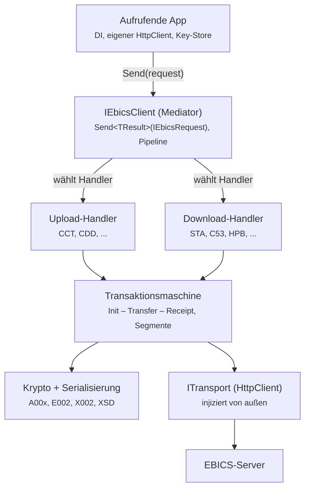
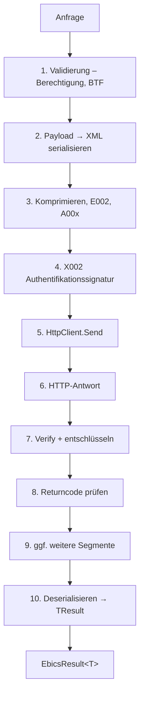

# EBICO.Connector — Architektur

`EBICO.Connector` ist die Client-Bibliothek für den Zugriff auf einen
EBICS-Server (den Emulator `EBICO.Server` oder eine echte Bank). Sie ist
fluent, testbar und DI-freundlich. Dieses Dokument beschreibt die tragende
Architektur und die wichtigsten Designentscheidungen samt Trade-offs.

## Leitidee: Mediator-Muster

Der Aufrufer kennt nur **eine** Methode — `IEbicsClient.Send(request)`. Er
übergibt ein Request-Objekt und bekommt ein typisiertes Ergebnis zurück. Die
gesamte EBICS-Komplexität (Transaktions-Skelett, Kryptografie, XML-Serialisierung,
Transport) liegt darunter und ist für den Aufrufer unsichtbar.

```csharp
var result = await client.Send(new CddUploadRequest { Pain008 = bytes });
```

**Warum Mediator hier passt:** EBICS-Aufträge unterscheiden sich erstaunlich
wenig. Nahezu jeder Auftrag ist entweder ein *Upload* (Initialisation →
Transfer) oder ein *Download* (Initialisation → Transfer → Receipt) und
unterscheidet sich nur in OrderType/BTF, Richtung und Payload-Behandlung. Ein
generischer Handler pro Richtung deckt damit den Großteil ab; Sonderfälle
(HPB, INI/HIA) bekommen eigene Handler. Das ist dasselbe Muster, das MediatR
populär gemacht hat — hier aber bewusst ohne diese Library (siehe
Designentscheidungen).

## Schichtenmodell



Von außen nach innen:

1. **Aufrufende App** — bringt Dependency Injection, einen eigenen
   `HttpClient` und einen Key-Store mit.
2. **`IEbicsClient` (Mediator)** — die einzige öffentliche Einstiegsmethode;
   schlägt anhand des Request-Typs den passenden Handler nach.
3. **Upload-/Download-Handler** — ein generischer Handler je Richtung plus
   Sonderfall-Handler (HPB, INI/HIA).
4. **Transaktionsmaschine** — kapselt das gemeinsame Init/Transfer/Receipt-
   Skelett samt Segmentierung.
5. **Krypto + Serialisierung** und **Transport** — die Querschnitts-Bausteine.
6. **EBICS-Server** — Gegenstelle (Emulator oder echt).

## Send-Pipeline

Jeder `Send`-Aufruf durchläuft eine Pipeline klar getrennter Stufen. Beispiel
für einen Upload; Schritte 9/10 sind die Download-Segmentschleife.



Jede Stufe ist eine eigene, isoliert unit-testbare Komponente. Die
Segmentschleife (9) ruft intern weiter, bis alle Segmente eines Downloads
vorliegen, und gibt erst dann das vollständige `TResult` zurück.

## Kern-Abstraktionen

```csharp
// Marker + Ergebnistyp-Bindung: Der Request "weiß", was er zurückgibt.
public interface IEbicsRequest<TResult> { }

// Der Mediator. Das ist alles, was die aufrufende App kennt.
public interface IEbicsClient
{
    Task<EbicsResult<TResult>> Send<TResult>(
        IEbicsRequest<TResult> request,
        CancellationToken ct = default);
}

// Beispiel-Request – nur Daten, keine Logik.
public sealed class CddUploadRequest : IEbicsRequest<UploadReceipt>
{
    public required ReadOnlyMemory<byte> Pain008 { get; init; }
}

// Ein Handler pro Request-Typ, vom Client nachgeschlagen.
public interface IEbicsRequestHandler<TRequest, TResult>
    where TRequest : IEbicsRequest<TResult>
{
    Task<EbicsResult<TResult>> Handle(
        TRequest request, EbicsContext ctx, CancellationToken ct);
}
```

Der Aufruf in der App bleibt dadurch trivial:

```csharp
var result = await client.Send(new CddUploadRequest { Pain008 = bytes });
```

## Designentscheidungen

### Eigener Dispatch statt MediatR-Library

Die Pipeline-Reihenfolge (Krypto vor Transport, Segment-Schleife) und die
Versionsabhängigkeit (H003/H004/H005) sind sehr EBICS-spezifisch. Ein eigener
Dispatch gibt volle Kontrolle und vermeidet eine Fremd-Dependency im
NuGet-Paket — eine schlanke Abhängigkeitsliste ist bei einem öffentlichen
Connector ein echtes Verkaufsargument.

*Trade-off:* MediatR würde Dispatch-Boilerplate sparen, bringt aber Kopplung
an die Library und weniger Kontrolle über die Pipeline.

### `EbicsResult<T>` statt Exceptions für fachliche Returncodes

EBICS liefert viele *fachliche* Returncodes (z. B. „noch keine Daten
vorhanden"), die keine Programmfehler sind. Diese als Result-Typ
zurückzugeben ist sauberer und zwingt den Aufrufer nicht in `try/catch` für
Normalfälle. Echte Transport- oder Krypto-Fehler dürfen weiterhin Exceptions
werfen.

### HttpClient hinter schmalem `ITransport`

Der von außen injizierte `HttpClient` wird nicht direkt durchgereicht, sondern
intern von einem `ITransport` genutzt. So integriert der Connector sauber in
`IHttpClientFactory` / `AddHttpClient` (Polly-Resilienz, Named Clients,
Logging-Handler) — ohne dass die EBICS-Logik vom konkreten `HttpClient`
abhängt. Das hält die Kernlogik transport-agnostisch und testbar.

### Key-Store als Abstraktion (`IKeyStore`)

Der Schlüsselspeicher ist nicht fest auf Dateien verdrahtet: im Test
In-Memory-Schlüssel, in Produktion Datei, HSM oder ein eigener Store. Das
hält die Krypto-Schicht isoliert testbar.

## DI-Registrierung (Zielbild)

```csharp
services.AddEbicoConnector(o =>
{
    o.HostId    = "...";
    o.PartnerId = "...";
    o.UserId    = "...";
    o.Version   = EbicsVersion.H005;
})
.AddHttpClient();   // eigener HttpClient, eigene Resilienz-Policy
```

## Testbarkeit (Bezug zur projektweiten Anforderung)

Die strikte Stufen-Trennung der Pipeline ist die Grundlage für „Unit-Tests pro
Feature": Validierung, Serialisierung, Krypto-Stufen, Transport und
Deserialisierung lassen sich je einzeln testen. Über `ITransport` und
`IKeyStore` werden Server-Antworten und Schlüssel im Test deterministisch
gestellt (keine echten Netz-/Dateizugriffe).

---

> Diese Seite ist die gepflegte Referenz. Bei Architekturänderungen hier (und
> ggf. in einer ADR) nachziehen; der Connector-Epic im Issue-Tracker verweist
> auf dieses Dokument.
