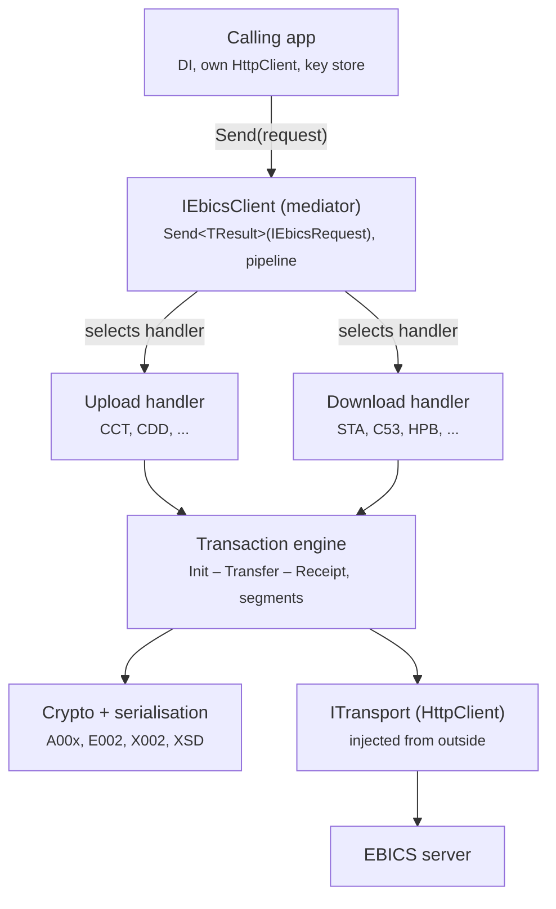
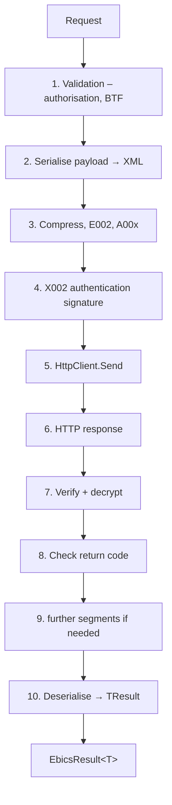
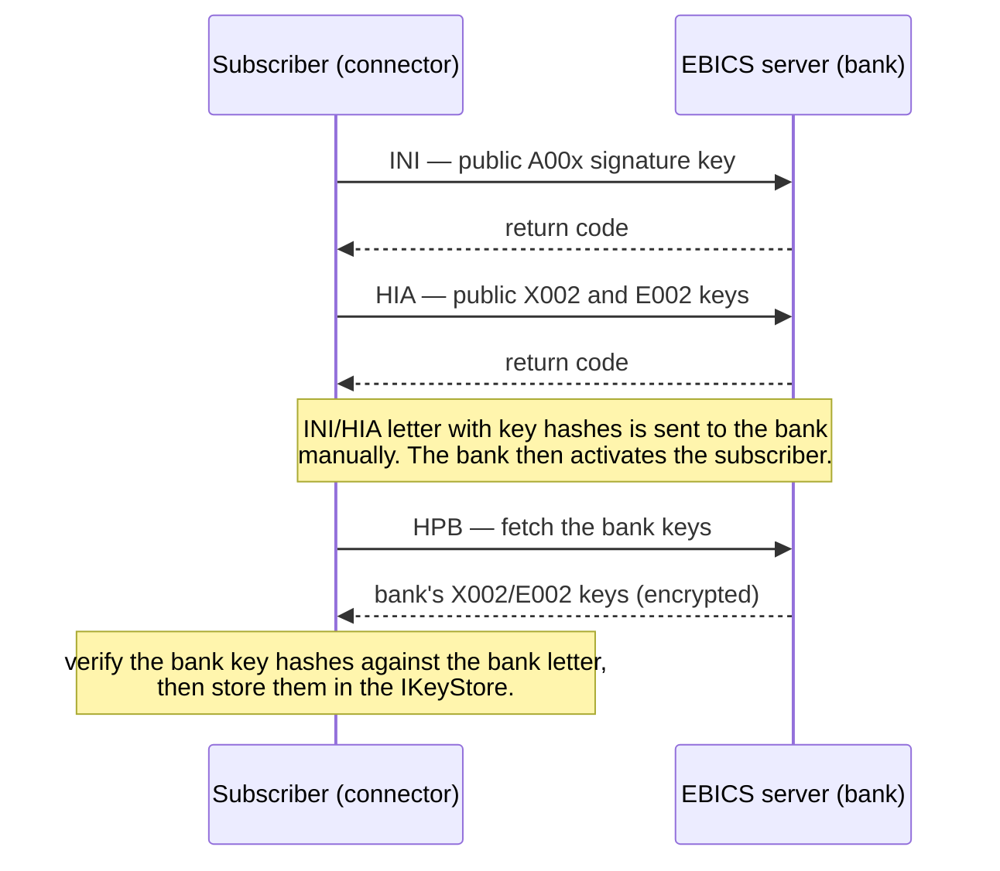
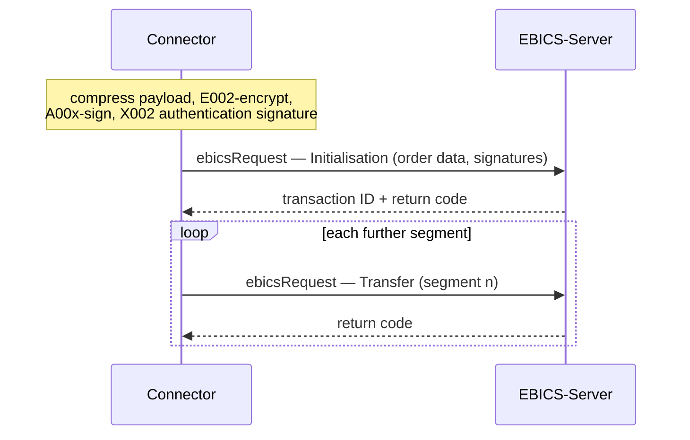
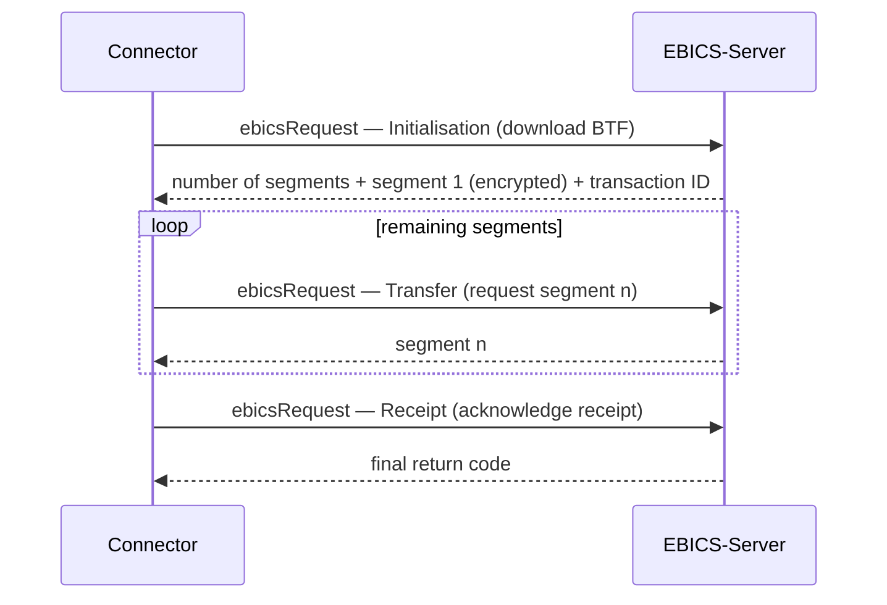

# EBICO.Connector — Architecture

`EBICO.Connector` is the client library for accessing an EBICS server (the
`EBICO.Server` emulator or a real bank). It is fluent, testable and
DI-friendly. This document describes the underlying architecture and the key
design decisions along with their trade-offs.

> **Status:** The `EBICO.Connector` is implemented across issues #46–#50
> (onboarding, upload and download for H003/H004/H005); with the client-side
> validation (#44, pipeline stage 1) the send pipeline is fully wired up.
> Which building blocks live where is shown in the section **"Building blocks:
> present vs. planned"** further below. Flow details — such as the order of
> E002/A00x/X002 or the per-version segment loop — still need to be verified
> against the official EBICS XSDs/annexes once the schemas are available (the
> respective spec caveats are noted on the individual connector doc pages).

## Guiding idea: mediator pattern

The caller knows only **one** method — `IEbicsClient.Send(request)`. It passes
a request object and gets back a typed result. The entire EBICS complexity
(transaction skeleton, cryptography, XML serialization, transport) sits beneath
it and is invisible to the caller.

```csharp
var result = await client.Send(new CddUploadRequest { Pain008 = bytes });
```

**Why mediator fits here:** EBICS orders differ surprisingly little. Almost
every order is either an *upload* (Initialisation → Transfer) or a *download*
(Initialisation → Transfer → Receipt) and differs only in OrderType/BTF,
direction and payload handling. A generic handler per direction therefore
covers the bulk of it; special cases (HPB, INI/HIA) get their own handlers.
This is the same pattern that made MediatR popular — but here deliberately
without that library (see [Design decisions](#design-decisions) and
[ADR-0005](../adr/0005-connector-dispatch-without-mediatr.md)).

## Layer model


```mermaid
flowchart TD
    A["Calling app<br/><small>DI, own HttpClient, key store</small>"] -->|"Send(request)"| B["IEbicsClient (mediator)<br/><small>Send&lt;TResult&gt;(IEbicsRequest), pipeline</small>"]
    B -->|selects handler| C1["Upload handler<br/><small>CCT, CDD, ...</small>"]
    B -->|selects handler| C2["Download handler<br/><small>STA, C53, HPB, ...</small>"]
    C1 --> D["Transaction engine<br/><small>Init – Transfer – Receipt, segments</small>"]
    C2 --> D
    D --> E1["Crypto + serialisation<br/><small>A00x, E002, X002, XSD</small>"]
    D --> E2["ITransport (HttpClient)<br/><small>injected from outside</small>"]
    E2 --> F["EBICS server"]
```

From the outside in:

1. **Calling app** — brings its own dependency injection, its own
   `HttpClient` and a key store.
2. **`IEbicsClient` (mediator)** — the single public entry method; looks up the
   appropriate handler based on the request type.
3. **Upload/download handlers** — one generic handler per direction plus
   special-case handlers (HPB, INI/HIA).
4. **Transaction machine** — encapsulates the shared Init/Transfer/Receipt
   skeleton including segmentation.
5. **Crypto + serialization** and **transport** — the cross-cutting building
   blocks.
6. **EBICS server** — the counterpart (emulator or real).

## Send pipeline

Every `Send` call runs through a pipeline of clearly separated stages. Example
for an upload; steps 9/10 are the download segment loop.


```mermaid
flowchart TD
    R[Request] --> S1[1. Validation – authorisation, BTF]
    S1 --> S2[2. Serialise payload → XML]
    S2 --> S3[3. Compress, E002, A00x]
    S3 --> S4[4. X002 authentication signature]
    S4 --> S5[5. HttpClient.Send]
    S5 --> S6[6. HTTP response]
    S6 --> S7[7. Verify + decrypt]
    S7 --> S8[8. Check return code]
    S8 --> S9[9. further segments if needed]
    S9 --> S10[10. Deserialise → TResult]
    S10 --> Res["EbicsResult&lt;T&gt;"]
```

Each stage is its own component that can be unit-tested in isolation. The
segment loop (9) keeps calling internally until all segments of a download are
present, and only then returns the complete `TResult`. The concrete shape of
the crypto stages is described on their own doc pages:
[XML serialization & C14N](../protocol/serialization-c14n.md),
[Encryption E002](../protocol/encryption-e002.md) and
[Bank-technical signature A005/A006](../protocol/bank-signature.md).

## Core abstractions

```csharp
// Marker + result-type binding: the request "knows" what it returns.
public interface IEbicsRequest<TResult> { }

// The mediator. This is all the calling app knows.
public interface IEbicsClient
{
    Task<EbicsResult<TResult>> Send<TResult>(
        IEbicsRequest<TResult> request,
        CancellationToken ct = default);
}

// Example request – data only, no logic.
public sealed class CddUploadRequest : IEbicsRequest<UploadReceipt>
{
    public required ReadOnlyMemory<byte> Pain008 { get; init; }
}

// One handler per request type, looked up by the client.
public interface IEbicsRequestHandler<TRequest, TResult>
    where TRequest : IEbicsRequest<TResult>
{
    Task<EbicsResult<TResult>> Handle(
        TRequest request, EbicsContext ctx, CancellationToken ct);
}
```

The call in the app therefore stays trivial:

```csharp
var result = await client.Send(new CddUploadRequest { Pain008 = bytes });
```

> **Distinction from Core:** `IEbicsRequest<TResult>` is the *app-side* request
> abstraction of the connector. It is deliberately kept separate from the
> protocol-level envelope interfaces in `EBICO.Core`
> (`IEbicsRequestEnvelope`/`IEbicsResponseEnvelope`, see
> [Version dispatch](../protocol/version-dispatch.md)) — both live on
> different layers.

## Onboarding flows: INI / HIA / HPB

Before a subscriber can send business orders, the key exchange must be
complete. The connector encapsulates this in three special-case handlers; the
keys themselves come from the [`IKeyStore`](#key-store-as-an-abstraction-ikeystore).


```mermaid
sequenceDiagram
    participant C as Subscriber (connector)
    participant S as EBICS server (bank)
    C->>S: INI — public A00x signature key
    S-->>C: return code
    C->>S: HIA — public X002 and E002 keys
    S-->>C: return code
    Note over C,S: INI/HIA letter with key hashes is sent to the bank<br/>manually. The bank then activates the subscriber.
    C->>S: HPB — fetch the bank keys
    S-->>C: bank's X002/E002 keys (encrypted)
    Note over C: verify the bank key hashes against the bank letter,<br/>then store them in the IKeyStore.
```

- **INI** transmits the subscriber's public **A00x** signature key
  (bank-technical signature, see [A005/A006](../protocol/bank-signature.md)).
- **HIA** transmits the subscriber's public **X002** authentication and
  **E002** encryption keys.
- **HPB** is a *download*: the subscriber fetches the bank's public keys
  (X002/E002) and verifies their hash against the bank letter.

Only after INI + HIA + HPB and activation by the bank are uploads (e.g.
CCT/CDD) and downloads (e.g. STA/C53) possible — this matches the acceptance
criterion of the connector epic. For key versions and representation see
[Key pairs & representation](../protocol/key-representation.md).

## Transaction skeleton: upload and download

All business orders share a common transaction skeleton that the transaction
machine encapsulates. It is exactly this commonality that makes one generic
handler per direction possible.

### Upload (Initialisation → Transfer)


```mermaid
sequenceDiagram
    participant C as Connector
    participant S as EBICS-Server
    Note over C: compress payload, E002-encrypt,<br/>A00x-sign, X002 authentication signature
    C->>S: ebicsRequest — Initialisation (order data, signatures)
    S-->>C: transaction ID + return code
    loop each further segment
        C->>S: ebicsRequest — Transfer (segment n)
        S-->>C: return code
    end
```

### Download (Initialisation → Transfer → Receipt)


```mermaid
sequenceDiagram
    participant C as Connector
    participant S as EBICS-Server
    C->>S: ebicsRequest — Initialisation (download BTF)
    S-->>C: number of segments + segment 1 (encrypted) + transaction ID
    loop remaining segments
        C->>S: ebicsRequest — Transfer (request segment n)
        S-->>C: segment n
    end
    C->>S: ebicsRequest — Receipt (acknowledge receipt)
    S-->>C: final return code
```

The upload ends after the transfer phase; the download additionally
acknowledges, via a **Receipt** phase, whether the data was received completely
and usably. The download segment loop corresponds to stage 9 of the
[send pipeline](#send-pipeline).

## Design decisions

### Own dispatch instead of the MediatR library

The pipeline order (crypto before transport, segment loop) and the version
dependency (H003/H004/H005) are very EBICS-specific. An own dispatch gives full
control and avoids a third-party dependency in the NuGet package — a lean
dependency list is a genuine selling point for a public connector.

*Trade-off:* MediatR would save dispatch boilerplate but brings coupling to the
library and less control over the pipeline. Detailed rationale:
[ADR-0005](../adr/0005-connector-dispatch-without-mediatr.md).

### `EbicsResult<T>` instead of exceptions for business return codes

EBICS returns many *business* return codes (e.g. "no data available yet") that
are not program errors. Returning these as a result type is cleaner and does
not force the caller into `try/catch` for the normal case. Genuine transport or
crypto errors may still throw exceptions. The shape of the result type is
described in the section
[Result and return code model](#ebicsresultt--result-and-return-code-model).

### HttpClient behind a narrow `ITransport`

The externally injected `HttpClient` is not passed through directly but used
internally by an `ITransport`. This lets the connector integrate cleanly with
`IHttpClientFactory` / `AddHttpClient` (Polly resilience, named clients,
logging handlers) — without the EBICS logic depending on the concrete
`HttpClient`. This keeps the core logic transport-agnostic and testable.

### Key store as an abstraction (`IKeyStore`)

The key store is not hard-wired to files: in-memory keys in tests, a file, an
HSM or a custom store in production. This keeps the crypto layer isolated and
testable. The `IKeyStore` provides the subscriber and bank keys exchanged
during [onboarding](#onboarding-flows-ini--hia--hpb); for key representation see
[Key pairs & representation](../protocol/key-representation.md). The
`IKeyStore` abstraction as well as an `InMemoryKeyStore` and a simple
`FileKeyStore` are implemented with **#46** (see
[Client core & configuration](client-core.md)).

## `EbicsResult<T>` — Result and return code model

`EbicsResult<T>` cleanly separates three cases: technical success with a value,
a business return code (no error) and — distinct from that — genuine technical
errors that are thrown as an exception.

```csharp
// Sketch; the final form incl. the return-code catalogue follows in #36 (M4).
public readonly record struct EbicsResult<T>
{
    public bool IsSuccess { get; init; }        // order functionally successful?
    public T? Value { get; init; }              // set on success only
    public string ReturnCode { get; init; }     // EBICS return code, e.g. "000000"
    public string? ReturnText { get; init; }    // human-readable text
}
```

Example business codes: `000000` (OK), `011000` (download post-processing done)
or a "no data available" code — they lead to an `EbicsResult`, **not** to an
exception. A **preliminary** form of this type has existed since **#46** in
`EBICO.Connector` (with `Success`/`Failure` factories); the complete, maintained
return code catalog and the associated ADR will be worked out separately in
**#36 (return code modelling, M4)** and reconciled then.

## Error handling, cancellation and resilience

- **Boundary business ↔ technical:** Business return codes → `EbicsResult<T>`
  (no throw). Technical errors (network/HTTP errors, failed signature
  verification, non-deserializable XML) → exception. This keeps the normal path
  `try/catch`-free.
- **Cancellation:** The `CancellationToken` from `Send(...)` is passed through
  all async stages down into the `ITransport`/`HttpClient`.
- **Resilience belongs on the HttpClient, not in the core:** Timeouts, retries
  and circuit breakers are configured via `IHttpClientFactory`/Polly on the
  injected `HttpClient` (named client). The connector core stays free of retry
  logic.
- **Idempotency note:** EBICS transactions are stateful (transaction ID across
  multiple segments). Blindly retrying individual transfer segments is delicate;
  retries target the connection/initialization level, not half-completed
  transactions.

## Version dependency (H003/H004/H005)

The connector is multi-version capable. The target version comes from the
configuration (`o.Version`, see [DI registration](#di-registration)) and
affects envelope namespaces, header structure and partly crypto defaults. The
selection and detection of the version relies on the Core building blocks
(`EbicsVersion` registry, `EbicsVersionDetector`, envelope bindings). Background
and strategy: [Version dispatch](../protocol/version-dispatch.md) and
[ADR-0004 (multi-version strategy)](../adr/0004-multi-version-strategy.md).

## DI registration

Implemented in **#46** (see [Client core & configuration](client-core.md)).
`AddEbicoConnector(...)` returns the `IHttpClientBuilder` of the connector's own
named client, so that timeouts and resilience can be configured directly on the
HttpClient (resilience packages stay on the caller side):

```csharp
services.AddEbicoConnector(o =>
{
    o.Url       = "https://bank.example/ebicsweb";
    o.HostId    = "...";
    o.PartnerId = "...";
    o.UserId    = "...";
    o.Version   = EbicsVersion.H005;
})
.ConfigureHttpClient(c => c.Timeout = TimeSpan.FromSeconds(30))
.AddStandardResilienceHandler();   // optional, package on the caller's side
```

> Refinement over the original sketch (`.AddHttpClient()`): the return value is
> an `IHttpClientBuilder`, which makes resilience/timeout configuration on the
> connector client first-class.

## Testability (relation to the project-wide requirement)

The strict stage separation of the pipeline is the foundation for "unit tests
per feature": validation, serialization, crypto stages, transport and
deserialization can each be tested individually. Via `ITransport` and
`IKeyStore`, server responses and keys are set deterministically in tests (no
real network/file access).

## Building blocks: present vs. planned

The connector **core** (client, dispatch, configuration, transport, key store)
is set up with **#46**, onboarding (INI/HIA/HPB) with **#47**, the **upload
API** (CCT/CDD/CDB/CIP) with **#48** and the **download API**
(STA/C53/VMK/C52/C54 as well as HAC/HTD/HKD/HAA/HPD/PTK) with **#49**. The
client-side **validation stage** (authorisation/BTF, pipeline stage 1) was added
with **#44** and completes the send pipeline (see
[Client core](client-core.md#client-side-validation-stage-1)). The following
table maps the [send pipeline](#send-pipeline) stages to the existing building
blocks — so the maturity is transparent and no false "done" impression arises.

| Pipeline stage | Building block | Status |
| --- | --- | --- |
| 2. Serialize / 10. Deserialize | `Core/Serialization/EbicsXmlSerializer` | ✅ present |
| (Canonicalization for signatures) | `Core/Serialization/XmlCanonicalizer` (C14N) | ✅ present |
| 3. E002 encryption / 7. Decrypt | `Core/Crypto/EncryptionE002` | ✅ present |
| 3. A00x signature / 7. Verify | `Core/Crypto/BankSignature` (A005/A006) | ✅ present |
| (Key material) | `Core/Crypto/RsaKeyMaterial`, `KeyVersions` | ✅ present |
| 5. Transport (`ITransport`/HttpClient) | `Connector/Transport/HttpClientTransport` | ✅ #46 |
| Connector core (`IEbicsClient`, dispatch, handler, DI) | `Connector` (client, dispatch, DI) | ✅ #46 |
| Key store (`IKeyStore`) | `Connector/Keys` (InMemory + File) | ✅ #46 |
| 8. Return code handling (`EbicsResult<T>`) | `Connector/EbicsResult<T>` (preliminary) | 🟡 #46, catalog #36 |
| 3. Compression | `Core/Serialization/EbicsCompression` (ZIP/zlib) | ✅ #47 |
| 4. X002 authentication signature | `Core/Crypto/AuthenticationSignature` (wired in the HPB flow) | ✅ #47 (HPB) |
| Onboarding handler (INI/HIA/HPB) | `Connector/Onboarding` (requests/handler/builder, `AddEbicoOnboarding`) | ✅ #47 |
| Key generation + INI/HIA letter | `Connector/Onboarding` (`ISubscriberKeyGenerator`, `IInitializationLetterRenderer`) | ✅ #47 |
| 9. Segmentation | `Core/Serialization/EbicsSegmentation` (wired in the upload) | ✅ #48 |
| Upload handler (CCT/CDD/CDB/CIP) | `Connector/Upload` (requests/handler/builder, `AddEbicoUpload`) | ✅ #48 |
| 1. Validation (authorisation, BTF) | `Connector/Validation/RequestValidator` (wired in the upload/download executor) | ✅ #44 |
| Download handler (STA/VMK/C53/C52/C54, HAC/HTD/HKD/HAA/HPD/PTK) | `Connector/Download` (requests/handler/builder, Receipt, parse hooks, `AddEbicoDownload`) | ✅ #49 |

## Related docs

- [Client core & configuration](client-core.md) — #46: abstractions, options/DI, dispatch, transport, key store
- [Onboarding flows INI / HIA / HPB](onboarding.md) — #47: key generation, INI/HIA/HPB handlers, version dispatch, INI letter (text/PDF)
- [ADR-0005 — Connector dispatch without MediatR](../adr/0005-connector-dispatch-without-mediatr.md)
- [ADR-0004 — Multi-version strategy](../adr/0004-multi-version-strategy.md)
- [Version dispatch](../protocol/version-dispatch.md)
- [XML serialization & C14N](../protocol/serialization-c14n.md)
- [Encryption E002](../protocol/encryption-e002.md)
- [Bank-technical signature A005/A006](../protocol/bank-signature.md)
- [Key pairs & representation (A/E/X)](../protocol/key-representation.md)

---

> This page is the maintained reference. On architecture changes, update it here
> (and possibly in an ADR); the connector epic in the issue tracker points to
> this document. Changes to the return code model are reconciled with #36 (M4),
> dispatch decisions with ADR-0005.
