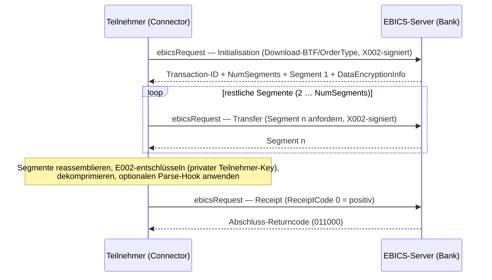

# Connector: Download-API (STA / C53 / VMK / C52 / C54 …)

> Umsetzung von **Issue #49** (Milestone M6 — Connector). Diese Seite beschreibt die clientseitige
> Download-API des `EBICO.Connector`: die generische Download-Methode, die Convenience-Requests
> (Kontoauszüge/Reports und Status-/Protokoll-Orders), die optionalen **Parsing-Hooks**, die
> clientseitige Krypto-Pipeline (Segmente sammeln → Reassemblieren → E002-Entschlüsseln →
> Dekomprimieren) und die dreiphasige Download-Transaktion inklusive **Receipt**. Grundlage ist der
> [Client-Kern](client-core.md) (#46) und das abgeschlossene [Onboarding](onboarding.md) (#47); die
> Gegenrichtung ist die [Upload-API](upload.md) (#48), der Gesamtentwurf steht in der
> [Connector-Architektur](architecture.md).

## Zweck

Nach abgeschlossenem Onboarding (INI/HIA/HPB und Aktivierung durch die Bank) kann ein Teilnehmer
Bankdaten abrufen — Kontoauszüge/Reports (STA/VMK/C53/C52/C54) und administrative Downloads
(HAC/HTD/HKD/HAA/HPD/PTK). Die Download-API führt die EBICS-Download-Transaktion aus **drei Phasen**:
**Initialisation** (Auftragsmetadaten senden, Segmentanzahl + Segment 1 + verschlüsselten
Transaktionsschlüssel empfangen), **Transfer** (die restlichen Segmente abrufen) und **Receipt**
(den vollständigen, verwertbaren Empfang quittieren). Die entschlüsselten, dekomprimierten
Auftragsdaten liefert die API als Roh-Bytes; ein optionaler Parsing-Hook kann sie in eine typisierte
Form überführen.

Die Gegenseite ist der Emulator: die
[Download-Transaktion](../server/download-transaction.md) (#33), die
[Kontoauszug-Orders](../server/statement-orders.md) (#40) und die
[Status-/Protokoll-Orders](../server/status-protocol-orders.md) (#41) erzeugen die Inhalte
serverseitig. Diese API ist der **inverse** Ablauf zur Upload-API.



## Öffentliche API

```csharp
services.AddEbicoConnector(o => { /* Url, HostId, PartnerId, UserId, Version */ })
        .Services.AddEbicoDownload();
```

### Convenience-Requests

Für die gängigen Downloads genügt ein sprechender Request; der Order-Typ ist fest hinterlegt:

```csharp
var client = provider.GetRequiredService<IEbicsClient>();

// Bank-to-Customer Statement (C53, camt.053), optional mit Zeitraum
EbicsResult<DownloadResult> result = await client.Send(new C53DownloadRequest
{
    Period = new DateRange(new DateOnly(2026, 1, 1), new DateOnly(2026, 3, 31)),
});

if (result.IsSuccess)
{
    ReadOnlyMemory<byte> orderData = result.Value!.OrderData; // entschlüsselter Plaintext (i. d. R. ZIP)
    Console.WriteLine($"Transaktion {result.Value.TransactionId}, {result.Value.NumSegments} Segment(e)");
}
else
{
    Console.WriteLine($"Abgelehnt: {result.ReturnCode} {result.ReturnText}");
}
```

**Kontoauszüge & Reports** (H005: `BTD` + BTF):

| Request | Order-Typ | Nachricht |
| --- | --- | --- |
| `StaDownloadRequest` | `STA` — Kontoauszug | SWIFT `mt940` |
| `VmkDownloadRequest` | `VMK` — Zwischensaldenreport | SWIFT `mt942` |
| `C53DownloadRequest` | `C53` — Bank-to-Customer Statement | `camt.053` |
| `C52DownloadRequest` | `C52` — Bank-to-Customer Account Report | `camt.052` |
| `C54DownloadRequest` | `C54` — Debit/Credit Notification | `camt.054` |

**Status-/Protokoll-Orders** (H005: `AdminOrderType`, **kein** BTF):

| Request | Order-Typ | Inhalt |
| --- | --- | --- |
| `HtdDownloadRequest` | `HTD` | Kunden-/Teilnehmerdaten |
| `HkdDownloadRequest` | `HKD` | Kundendaten inkl. aller Teilnehmer |
| `HaaDownloadRequest` | `HAA` | verfügbare Order-Typen |
| `HpdDownloadRequest` | `HPD` | Bankparameter |
| `HacDownloadRequest` | `HAC` | Kundenprotokoll (XML) |
| `PtkDownloadRequest` | `PTK` | Kundenprotokoll (Text) |

### Parsing-Hooks

Jeder Request nimmt einen optionalen `Parse`-Delegaten. Er wird **nach dem Entschlüsseln und vor dem
Receipt** auf die Roh-Bytes angewandt; sein Ergebnis liegt typsicher über `ParsedAs<T>()` vor. So
bleibt der Connector formatagnostisch (er kennt weder ZIP noch camt), und der Aufrufer bestimmt die
Zielform:

```csharp
var result = await client.Send(new C53DownloadRequest
{
    Parse = bytes => MyStatementParser.ReadEntries(bytes), // eigener Hook
});

IReadOnlyList<StatementEntry>? entries = result.Value!.ParsedAs<IReadOnlyList<StatementEntry>>();
byte[] raw = result.Value.OrderData.ToArray();             // die Roh-Bytes bleiben zugänglich
```

Wirft der Hook eine Ausnahme, sendet der Connector ein **negatives Receipt** (der Server stellt die
Daten erneut bereit) und reicht die Ausnahme weiter.

### Generische Download-Methode

Für andere Auftragsarten oder feine Kontrolle dient `DownloadRequest`:

```csharp
// H005 über eine BTF …
await client.Send(new DownloadRequest { Btf = new BusinessTransactionFormat("EOP", messageName: "camt.053") });

// … oder über einen klassischen Order-Typ (H003/H004 direkt; H005 leitet die BTF für Auszüge daraus ab)
await client.Send(new DownloadRequest { OrderType = "C53" });

// … oder generisch als FDL mit FileFormat (nur H003/H004)
await client.Send(new DownloadRequest { FileFormat = "camt.053", Period = new DateRange(from, to) });
```

Das Ergebnis ist stets ein `EbicsResult<DownloadResult>` mit der hex-kodierten `TransactionId`, der
Segmentanzahl, den entschlüsselten `OrderData` und — bei gesetztem Hook — dem `Parsed`-Wert.

## Ablauf (clientseitig)

Der `DownloadExecutor` orchestriert je `Send`:

1. **Keys laden** — nur Teilnehmerschlüssel: der private **E002**-Schlüssel (zum Entschlüsseln) und der
   **X002**-Schlüssel (zum Signieren der Requests). Ein Bank-Schlüssel wird nicht benötigt (die Daten
   sind für den Teilnehmer verschlüsselt).
2. **Order-Identität** — versionsabhängig auflösen (siehe [Versions-Dispatch](#versions-dispatch)).
3. **Initialisation** — versionsabhängiger `ebicsRequest`, unsigniert serialisiert, dann mit der
   **X002-Authentifikationssignatur** (`AuthenticationSignature.Sign`) versehen und gesendet. Aus der
   Antwort werden Returncode, `TransactionId`, `NumSegments`, `DataEncryptionInfo/TransactionKey` und
   das **erste** Segment übernommen (Fehler-Returncode → `EbicsResult.Failure`).
4. **Transfer** — für die Segmente 2 … `NumSegments` je ein X002-signierter `ebicsRequest`; die
   gelieferten Order-Data-Segmente werden gesammelt.
5. **Reassemblieren/Entschlüsseln/Dekomprimieren** — `EbicsSegmentation.Reassemble` →
   `EncryptionE002.Decrypt` (RSA-OAEP über den Transaktionsschlüssel mit dem **privaten**
   Teilnehmer-E002-Schlüssel, dann AES-128-CBC über die Auftragsdaten) → `EbicsCompression.Decompress`.
   Schlägt dies fehl, wird ein **negatives Receipt** gesendet und eine `EbicsConnectorException` geworfen.
6. **Parsing-Hook** (falls gesetzt) — auf die Roh-Bytes angewandt; bei Ausnahme negatives Receipt + rethrow.
7. **Receipt** — X002-signierter `ebicsRequest` mit `ReceiptCode = 0` (positiv); der Server bestätigt
   mit `011000` (`EBICS_DOWNLOAD_POSTPROCESS_DONE`).
8. **Ergebnis** — `EbicsResult.Success(DownloadResult)`.

Wiederverwendete Core-Primitives:
[`EbicsSegmentation`](../server/segmentation.md), [`EncryptionE002`](../protocol/encryption-e002.md),
[`EbicsCompression`](../server/segmentation.md),
[`AuthenticationSignature`](../protocol/auth-signature-x002.md),
[`BtfOrderTypeCatalog`](../server/btf-framework.md), `KeyVersions`.

## Versions-Dispatch

Je ein Envelope-Builder pro Version hinter einer Registry (Muster wie bei Upload/Onboarding):

| Version | Order-Details |
| --- | --- |
| **H005** | Kontoauszüge: `AdminOrderType = "BTD"` + `BTDOrderParams/Service` (BTF, aus dem Order-Typ aufgelöst); Status-/Protokoll-Orders: `AdminOrderType = "HTD"` … **direkt** (kein BTF) |
| **H003 / H004** | klassischer `OrderType` (z. B. `STA`, `HTD`) direkt, oder `FDL` + `FDLOrderParams/FileFormat`; optionaler Zeitraum in `FDLOrderParams`/`StandardOrderParams`; `OrderAttribute = DZHNN` |

Der Zeitraum (`Period`) landet in den versionsspezifischen Order-Params (`BTDOrderParams` für H005,
`FDLOrderParams`/`StandardOrderParams` für H003/H004) und wird nur gesendet, wenn beide Grenzen gesetzt
sind. Auf H005 tragen administrative Order-Typen keinen Zeitraum (die Bindings sehen dort keine
`DateRange` vor).

## Fehlerbehandlung

- **Fachliche Returncodes** (z. B. `090005` keine Daten vorhanden, `091101` unbekannte Transaction-ID,
  `091104` Segmentnummer überschritten) landen in `EbicsResult.Failure(ReturnCode, ReturnText)`.
- **Technische/Konfigurationsfehler** werfen: fehlende Teilnehmerschlüssel (Onboarding nicht gelaufen)
  → `EbicsConfigurationException`; unentschlüsselbare/-dekomprimierbare Daten → `EbicsConnectorException`
  (mit vorherigem negativem Receipt); Transportfehler → `EbicsTransportException`.
- Ein positives Receipt quittiert der Server mit `011000`; dieser Code steht dann in
  `EbicsResult.ReturnCode` (`IsSuccess == true`).

## Tests

`tests/EBICO.Tests/Connector/Download/` prüft über alle drei Versionen (H003/H004/H005):
Happy-Path-**Round-Trip** (der `FakeDownloadServer` kodiert den Payload exakt wie der Server —
Komprimieren → E002-Verschlüsseln → Segmentieren — und der Client stellt die Original-Bytes wieder her),
**Mehrsegment**-Downloads (Transfer-Count == `NumSegments − 1`), das **positive Receipt**, die korrekte
Order-Identität aller Convenience-Requests (H003/H004 direkter Code · H005 `BTD`+BTF bzw.
`AdminOrderType`), die Weitergabe des **Zeitraums**, den **Parsing-Hook** (`ParsedAs<T>()`), die
generische `FDL`-Route sowie die Negativfälle (Init-`090005`, Transfer-`091101`, fehlender Teilnehmer-
Enc-Key, nicht entschlüsselbare Daten und Parse-Fehler → jeweils **negatives Receipt**). Die
Server-Antworten baut ein Tier-A-Fake mit dem echten `EbicsResponseFactory`.

## Spec-Vorbehalte

- Die **X002-Antwortsignatur** des Servers wird nicht geprüft (der Server antwortet unsigniert, M4).
- Die Platzierung von `NumSegments` + Segment 1 in der Init-Antwort, der Segmente 2…N in den
  Transfer-Antworten und der `DataEncryptionInfo` (nur in der Init-Antwort) ist gegen die offiziellen
  EBICS-Annexe zu verifizieren (siehe [Download-Transaktion](../server/download-transaction.md)).
- Das `SecurityMedium` (`"0000"`), die `OrderAttribute`-Wahl (`DZHNN`) und die Behandlung des Zeitraums
  bei administrativen H005-Orders sind gegen die offiziellen Annexe zu verifizieren.

## Verwandte Doku

- [Connector-Architektur](architecture.md) — Send-Pipeline, Transaktions-Skelett (Init → Transfer → Receipt)
- [Client-Kern & Konfiguration](client-core.md) — #46: Dispatch, Options/DI, Transport, Key-Store
- [Upload-API (CCT/CDD/CDB/CIP)](upload.md) — #48: die Gegenrichtung
- [Onboarding-Flows INI / HIA / HPB](onboarding.md) — #47: Voraussetzung (Teilnehmerschlüssel)
- [Server: Download-Transaktion](../server/download-transaction.md) — die Gegenseite (#33)
- [Server: Kontoauszug-Orders](../server/statement-orders.md) — STA/VMK/C53/C52/C54-Erzeugung (#40)
- [Server: Status-/Protokoll-Orders](../server/status-protocol-orders.md) — HAC/HTD/HKD/HAA/HPD/PTK (#41)
- [Verschlüsselung E002](../protocol/encryption-e002.md) · [Authentifikationssignatur X002](../protocol/auth-signature-x002.md) · [Segmentierung](../server/segmentation.md)

---

> Diese Seite ist die gepflegte Referenz. Bei Änderungen an der Download-API hier (und im
> [Doku-Index](../index.md)) nachziehen.
