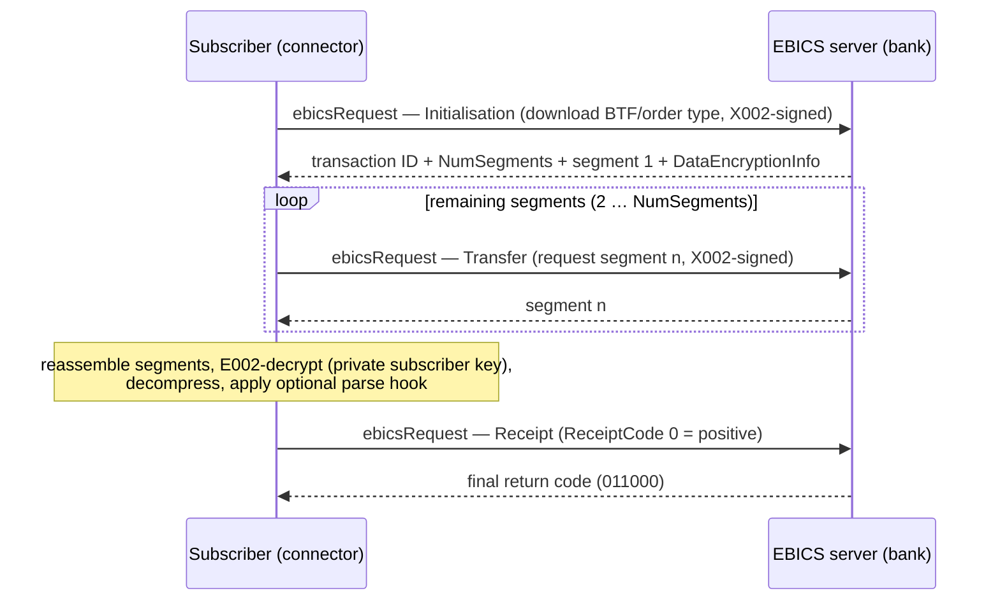

# Connector: Download API (STA / C53 / VMK / C52 / C54 …)

> Implementation of **issue #49** (milestone M6 — Connector). This page describes the client-side
> download API of the `EBICO.Connector`: the generic download method, the convenience requests
> (account statements/reports and status/protocol orders), the optional **parsing hooks**, the
> client-side crypto pipeline (collect segments → reassemble → E002 decrypt → decompress) and the
> three-phase download transaction including the **Receipt**. The basis is the
> [client core](client-core.md) (#46) and the completed [onboarding](onboarding.md) (#47); the
> opposite direction is the [upload API](upload.md) (#48), the overall design is in the
> [Connector architecture](architecture.md).

## Purpose

After completed onboarding (INI/HIA/HPB and activation by the bank) a subscriber can fetch bank
data — account statements/reports (STA/VMK/C53/C52/C54) and administrative downloads
(HAC/HTD/HKD/HAA/HPD/PTK). The download API runs the EBICS download transaction in **three phases**:
**Initialisation** (send order metadata, receive segment count + segment 1 + encrypted transaction
key), **Transfer** (fetch the remaining segments) and **Receipt** (acknowledge the complete, usable
receipt). The decrypted, decompressed order data is delivered by the API as raw bytes; an optional
parsing hook can convert it into a typed form.

The counterpart is the emulator: the
[download transaction](../server/download-transaction.md) (#33), the
[account statement orders](../server/statement-orders.md) (#40) and the
[status/protocol orders](../server/status-protocol-orders.md) (#41) produce the contents on the
server side. This API is the **inverse** flow to the upload API.


```mermaid
sequenceDiagram
    participant C as Subscriber (connector)
    participant S as EBICS server (bank)
    C->>S: ebicsRequest — Initialisation (download BTF/order type, X002-signed)
    S-->>C: transaction ID + NumSegments + segment 1 + DataEncryptionInfo
    loop remaining segments (2 … NumSegments)
        C->>S: ebicsRequest — Transfer (request segment n, X002-signed)
        S-->>C: segment n
    end
    Note over C: reassemble segments, E002-decrypt (private subscriber key),<br/>decompress, apply optional parse hook
    C->>S: ebicsRequest — Receipt (ReceiptCode 0 = positive)
    S-->>C: final return code (011000)
```

## Public API

```csharp
services.AddEbicoConnector(o => { /* Url, HostId, PartnerId, UserId, Version */ })
        .Services.AddEbicoDownload();
```

### Convenience requests

For the common downloads a descriptive request suffices; the order type is fixed:

```csharp
var client = provider.GetRequiredService<IEbicsClient>();

// Bank-to-Customer Statement (C53, camt.053), optionally with a period
EbicsResult<DownloadResult> result = await client.Send(new C53DownloadRequest
{
    Period = new DateRange(new DateOnly(2026, 1, 1), new DateOnly(2026, 3, 31)),
});

if (result.IsSuccess)
{
    ReadOnlyMemory<byte> orderData = result.Value!.OrderData; // decrypted plaintext (usually a ZIP)
    Console.WriteLine($"Transaction {result.Value.TransactionId}, {result.Value.NumSegments} segment(s)");
}
else
{
    Console.WriteLine($"Rejected: {result.ReturnCode} {result.ReturnText}");
}
```

**Account statements & reports** (H005: `BTD` + BTF):

| Request | Order type | Message |
| --- | --- | --- |
| `StaDownloadRequest` | `STA` — account statement | SWIFT `mt940` |
| `VmkDownloadRequest` | `VMK` — interim balance report | SWIFT `mt942` |
| `C53DownloadRequest` | `C53` — Bank-to-Customer Statement | `camt.053` |
| `C52DownloadRequest` | `C52` — Bank-to-Customer Account Report | `camt.052` |
| `C54DownloadRequest` | `C54` — Debit/Credit Notification | `camt.054` |

**Status/protocol orders** (H005: `AdminOrderType`, **no** BTF):

| Request | Order type | Content |
| --- | --- | --- |
| `HtdDownloadRequest` | `HTD` | customer/subscriber data |
| `HkdDownloadRequest` | `HKD` | customer data incl. all subscribers |
| `HaaDownloadRequest` | `HAA` | available order types |
| `HpdDownloadRequest` | `HPD` | bank parameters |
| `HacDownloadRequest` | `HAC` | customer protocol (XML) |
| `PtkDownloadRequest` | `PTK` | customer protocol (text) |

### Parsing hooks

Each request takes an optional `Parse` delegate. It is applied to the raw bytes **after decryption and
before the Receipt**; its result is available type-safely via `ParsedAs<T>()`. This keeps the
connector format-agnostic (it knows neither ZIP nor camt), and the caller determines the target form:

```csharp
var result = await client.Send(new C53DownloadRequest
{
    Parse = bytes => MyStatementParser.ReadEntries(bytes), // your own hook
});

IReadOnlyList<StatementEntry>? entries = result.Value!.ParsedAs<IReadOnlyList<StatementEntry>>();
byte[] raw = result.Value.OrderData.ToArray();             // the raw bytes stay accessible
```

If the hook throws an exception, the connector sends a **negative Receipt** (the server makes the
data available again) and rethrows the exception.

### Generic download method

For other order types or fine control, `DownloadRequest` serves:

```csharp
// H005 via a BTF …
await client.Send(new DownloadRequest { Btf = new BusinessTransactionFormat("EOP", messageName: "camt.053") });

// … or via a classic order type (H003/H004 directly; H005 derives the statement BTF from it)
await client.Send(new DownloadRequest { OrderType = "C53" });

// … or generically as FDL with a FileFormat (H003/H004 only)
await client.Send(new DownloadRequest { FileFormat = "camt.053", Period = new DateRange(from, to) });
```

The result is always an `EbicsResult<DownloadResult>` with the hex-encoded `TransactionId`, the
segment count, the decrypted `OrderData` and — when a hook is set — the `Parsed` value.

## Flow (client-side)

The `DownloadExecutor` orchestrates per `Send`:

1. **Load keys** — subscriber keys only: the private **E002** key (for decryption) and the
   **X002** key (for signing the requests). A bank key is not needed (the data is encrypted for the
   subscriber).
2. **Order identity** — resolve depending on version (see [Version dispatch](#version-dispatch)).
3. **Initialisation** — a version-dependent `ebicsRequest`, serialized unsigned, then furnished with
   the **X002 authentication signature** (`AuthenticationSignature.Sign`) and sent. From the response
   the return code, `TransactionId`, `NumSegments`, `DataEncryptionInfo/TransactionKey` and the
   **first** segment are taken (error return code → `EbicsResult.Failure`).
4. **Transfer** — for segments 2 … `NumSegments` one X002-signed `ebicsRequest` each; the delivered
   order data segments are collected.
5. **Reassemble/decrypt/decompress** — `EbicsSegmentation.Reassemble` →
   `EncryptionE002.Decrypt` (RSA-OAEP over the transaction key with the **private** subscriber E002
   key, then AES-128-CBC over the order data) → `EbicsCompression.Decompress`. If this fails, a
   **negative Receipt** is sent and an `EbicsConnectorException` is thrown.
6. **Parsing hook** (if set) — applied to the raw bytes; on exception negative Receipt + rethrow.
7. **Receipt** — X002-signed `ebicsRequest` with `ReceiptCode = 0` (positive); the server confirms
   with `011000` (`EBICS_DOWNLOAD_POSTPROCESS_DONE`).
8. **Result** — `EbicsResult.Success(DownloadResult)`.

Reused Core primitives:
[`EbicsSegmentation`](../server/segmentation.md), [`EncryptionE002`](../protocol/encryption-e002.md),
[`EbicsCompression`](../server/segmentation.md),
[`AuthenticationSignature`](../protocol/auth-signature-x002.md),
[`BtfOrderTypeCatalog`](../server/btf-framework.md), `KeyVersions`.

## Version dispatch

One envelope builder per version behind a registry (same pattern as with upload/onboarding):

| Version | Order details |
| --- | --- |
| **H005** | account statements: `AdminOrderType = "BTD"` + `BTDOrderParams/Service` (BTF, resolved from the order type); status/protocol orders: `AdminOrderType = "HTD"` … **directly** (no BTF) |
| **H003 / H004** | classic `OrderType` (e.g. `STA`, `HTD`) directly, or `FDL` + `FDLOrderParams/FileFormat`; optional period in `FDLOrderParams`/`StandardOrderParams`; `OrderAttribute = DZHNN` |

The period (`Period`) ends up in the version-specific order params (`BTDOrderParams` for H005,
`FDLOrderParams`/`StandardOrderParams` for H003/H004) and is only sent when both bounds are set. On
H005 administrative order types carry no period (the bindings do not provide a `DateRange` there).

## Error handling

- **Business return codes** (e.g. `090005` no data available, `091101` unknown transaction ID,
  `091104` segment number exceeded) end up in `EbicsResult.Failure(ReturnCode, ReturnText)`.
- **Technical/configuration errors** throw: missing subscriber keys (onboarding not run)
  → `EbicsConfigurationException`; non-decryptable/non-decompressible data → `EbicsConnectorException`
  (with a preceding negative Receipt); transport errors → `EbicsTransportException`.
- A positive Receipt is acknowledged by the server with `011000`; that code then stands in
  `EbicsResult.ReturnCode` (`IsSuccess == true`).

## Tests

`tests/EBICO.Tests/Connector/Download/` checks across all three versions (H003/H004/H005):
happy-path **round-trip** (the `FakeDownloadServer` encodes the payload exactly like the server —
compress → E002 encrypt → segment — and the client restores the original bytes),
**multi-segment** downloads (transfer count == `NumSegments − 1`), the **positive Receipt**, the
correct order identity of all convenience requests (H003/H004 direct code · H005 `BTD`+BTF or
`AdminOrderType`), the passing-through of the **period**, the **parsing hook** (`ParsedAs<T>()`), the
generic `FDL` route as well as the negative cases (init `090005`, transfer `091101`, missing
subscriber enc key, non-decryptable data and parse error → each a **negative Receipt**). The server
responses are built by a tier-A fake with the real `EbicsResponseFactory`.

## Spec caveats

- The server's **X002 response signature** is not checked (the server answers unsigned, M4).
- The placement of `NumSegments` + segment 1 in the init response, of segments 2…N in the transfer
  responses and of the `DataEncryptionInfo` (only in the init response) needs to be verified against
  the official EBICS annexes (see [download transaction](../server/download-transaction.md)).
- The `SecurityMedium` (`"0000"`), the `OrderAttribute` choice (`DZHNN`) and the handling of the
  period for administrative H005 orders need to be verified against the official annexes.

## Related docs

- [Connector architecture](architecture.md) — send pipeline, transaction skeleton (Init → Transfer → Receipt)
- [Client core & configuration](client-core.md) — #46: dispatch, options/DI, transport, key store
- [Upload API (CCT/CDD/CDB/CIP)](upload.md) — #48: the opposite direction
- [Onboarding flows INI / HIA / HPB](onboarding.md) — #47: prerequisite (subscriber keys)
- [E2E: Connector ↔ Server](../development/e2e-connector-server.md) — #57: C53 as a real round-trip against the server (instead of against `FakeDownloadServer`)
- [Server: download transaction](../server/download-transaction.md) — the counterpart (#33)
- [Server: account statement orders](../server/statement-orders.md) — STA/VMK/C53/C52/C54 generation (#40)
- [Server: status/protocol orders](../server/status-protocol-orders.md) — HAC/HTD/HKD/HAA/HPD/PTK (#41)
- [Connector: VEU](veu.md) — #124: the VEU downloads HVU/HVZ/HVD/HVT (the latter two via `DownloadRequest.Veu` or a `VeuOrderReference`)
- [Encryption E002](../protocol/encryption-e002.md) · [Authentication signature X002](../protocol/auth-signature-x002.md) · [Segmentation](../server/segmentation.md)

---

> This page is the maintained reference. On changes to the download API, update it here (and in the
> [doc index](../index.md)).
