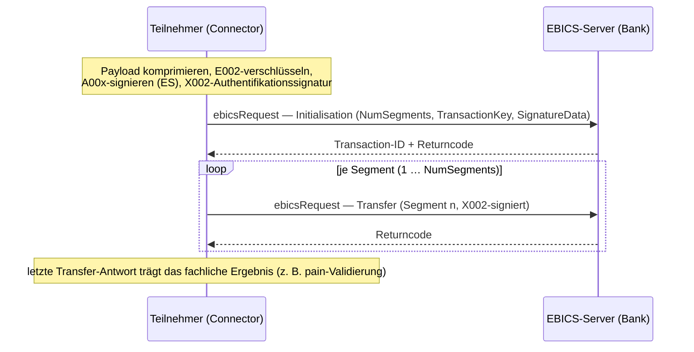

# Connector: Upload-API (CCT / CDD / CDB / CIP …)

> Umsetzung von **Issue #48** (Milestone M6 — Connector). Diese Seite beschreibt die clientseitige
> Upload-API des `EBICO.Connector`: die generische Upload-Methode, die SEPA-Convenience-Requests, die
> clientseitige Krypto-Pipeline (Komprimieren → E002-Verschlüsseln → elektronische Unterschrift →
> Segmentieren → X002-Authentifikationssignatur) und die zweiphasige Upload-Transaktion. Grundlage ist
> der [Client-Kern](client-core.md) (#46) und das abgeschlossene [Onboarding](onboarding.md) (#47);
> der Gesamtentwurf steht in der [Connector-Architektur](architecture.md).

## Zweck

Nach abgeschlossenem Onboarding (INI/HIA/HPB und Aktivierung durch die Bank) kann ein Teilnehmer
fachliche Aufträge hochladen. Die Upload-API nimmt eine Payload (z. B. eine SEPA-`pain`-Nachricht),
bereitet sie clientseitig kryptografisch auf und überträgt sie in der EBICS-Upload-Transaktion aus
zwei Phasen: **Initialisation** (Auftragsmetadaten, verschlüsselter Transaktionsschlüssel, Signatur)
und **Transfer** (die Auftragsdaten segmentweise).

Die Gegenseite ist der Emulator: die
[Upload-Transaktion](../server/upload-transaction.md) (#32) und die
[Zahlungsverkehrs-Order-Verarbeitung](../server/payment-orders.md) (#39) verarbeiten CCT/CDD/CDB/CIP
serverseitig. Diese API ist der **inverse** Ablauf.



## Öffentliche API

```csharp
services.AddEbicoConnector(o => { /* Url, HostId, PartnerId, UserId, Version */ })
        .Services.AddEbicoUpload();
```

### Convenience-Requests (SEPA-Zahlungsverkehr)

Für die gängigen SEPA-Orders genügt ein sprechender Request; der Order-Typ ist fest hinterlegt:

```csharp
var client = provider.GetRequiredService<IEbicsClient>();

// SEPA Credit Transfer (CCT, pain.001)
EbicsResult<UploadResult> result = await client.Send(new CctUploadRequest { Pain001 = painBytes });

if (result.IsSuccess)
{
    Console.WriteLine($"Transaktion {result.Value!.TransactionId}, {result.Value.NumSegments} Segment(e)");
}
else
{
    Console.WriteLine($"Abgelehnt: {result.ReturnCode} {result.ReturnText}");
}
```

| Request | Order-Typ | Nachricht |
| --- | --- | --- |
| `CctUploadRequest` | `CCT` — SEPA Credit Transfer | `pain.001` |
| `CddUploadRequest` | `CDD` — SEPA Direct Debit (CORE) | `pain.008` |
| `CdbUploadRequest` | `CDB` — SEPA Direct Debit (B2B) | `pain.008` |
| `CipUploadRequest` | `CIP` — SEPA Instant Credit Transfer | `pain.001` |

### Generische Upload-Methode

Für andere Auftragsarten oder feine Kontrolle dient `UploadRequest`:

```csharp
// H005 über eine BTF …
await client.Send(new UploadRequest
{
    OrderData = painBytes,
    Btf = new BusinessTransactionFormat("SCT", messageName: "pain.001"),
});

// … oder über einen klassischen Order-Typ (H003/H004 direkt; H005 leitet die BTF daraus ab)
await client.Send(new UploadRequest { OrderData = painBytes, OrderType = "CCT" });

// … oder generisch als FUL mit FileFormat (nur H003/H004)
await client.Send(new UploadRequest { OrderData = painBytes, FileFormat = "pain.001.001.09" });
```

`MaxSegmentSizeBytes` steuert die (rohe, vor-Base64-) Segmentgröße; ohne Angabe gilt der
Connector-Default. Das Ergebnis ist stets ein `EbicsResult<UploadResult>` mit der hex-kodierten
`TransactionId` und der Segmentanzahl.

## Ablauf (clientseitig)

Der `UploadExecutor` orchestriert je `Send`:

1. **Komprimieren** — `EbicsCompression.Compress` (zlib).
2. **Transaktionsschlüssel** — `EncryptionE002.GenerateTransactionKey` (einmalige AES-128).
3. **Schlüssel verschlüsseln** — `EncryptionE002.EncryptTransactionKey` (RSA-OAEP für den
   **Bank-E002-Schlüssel** aus dem `IKeyStore`; setzt gelaufenes HPB voraus).
4. **Auftragsdaten verschlüsseln** — `EncryptionE002.EncryptOrderData` (AES-128-CBC unter dem
   Transaktionsschlüssel).
5. **Elektronische Unterschrift (ES)** — `BankSignature.Sign` (A00x) über die Auftragsdaten, in eine
   versionsabhängige `UserSignatureData` verpackt (`S001` für H003/H004, `S002` für H005), dann
   komprimiert und mit demselben Transaktionsschlüssel verschlüsselt (`DataTransfer/SignatureData`).
6. **Segmentieren** — `EbicsSegmentation.Split` teilt den Chiffretext in `NumSegments` Segmente.
7. **Initialisation** — versionsabhängiger `ebicsRequest` mit `NumSegments`, `DataEncryptionInfo`
   (verschlüsselter Transaktionsschlüssel + Bank-Key-Fingerprint) und `SignatureData`; unsigniert
   serialisiert, dann **X002-Authentifikationssignatur** (`AuthenticationSignature.Sign`) gesetzt.
8. **Transaction-ID** aus der Antwort übernehmen (Fehler-Returncode → `EbicsResult.Failure`).
9. **Transfer** — je Segment ein X002-signierter `ebicsRequest`; die **letzte** Antwort trägt das
   fachliche Ergebnis (z. B. `090004` bei ungültiger pain).
10. **Ergebnis** — `EbicsResult.Success(UploadResult)`.

Wiederverwendete Core-Primitives:
[`EbicsCompression`](../server/segmentation.md), [`EncryptionE002`](../protocol/encryption-e002.md),
[`BankSignature`](../protocol/bank-signature.md),
[`AuthenticationSignature`](../protocol/auth-signature-x002.md),
[`EbicsSegmentation`](../server/segmentation.md), `PublicKeyFingerprint`, `KeyVersions`,
[`BtfOrderTypeCatalog`](../server/btf-framework.md).

## Versions-Dispatch

Die drei Einreichungs-Konventionen (kompatibel zu
[`BtfOrderTypeCatalog.ResolveUploadOrderType`](../server/payment-orders.md)) werden über je einen
Envelope-Builder pro Version hinter einer Registry abgebildet (Muster wie beim Onboarding):

| Version | Order-Details |
| --- | --- |
| **H005** | `AdminOrderType = "BTU"` + `BTUOrderParams/Service` (BTF); BTF wird aus dem Order-Typ aufgelöst, wenn nicht direkt gesetzt |
| **H003 / H004** | klassischer `OrderType` (z. B. `CCT`) direkt, oder `FUL` + `FULOrderParams/FileFormat`; `OrderAttribute = DZHNN` (nicht `OZHNN` = verteilte Unterschrift) |

## Fehlerbehandlung

- **Fachliche Returncodes** (z. B. `090003` keine Berechtigung, `090004` ungültige pain, `091101`
  unbekannte Transaction-ID) landen in `EbicsResult.Failure(ReturnCode, ReturnText)`.
- **Technische/Konfigurationsfehler** werfen: fehlender Bank-E002-Schlüssel (HPB nicht gelaufen) oder
  fehlende Teilnehmerschlüssel → `EbicsConfigurationException`; Transportfehler →
  `EbicsTransportException`.

## Tests

`tests/EBICO.Tests/Connector/Upload/` prüft über alle drei Versionen (H003/H004/H005):
Happy-Path-**Round-Trip** (der Test dekodiert die gesendeten Bytes exakt wie der Server —
Reassemble → E002-entschlüsseln → dekomprimieren — und vergleicht mit der Original-Payload),
**Mehrsegment**-Uploads, die korrekte Order-Identität der Convenience-Requests (Order-Typ bzw.
H005-BTF) sowie die Negativfälle (Init-`090003`, Transfer-`090004`, `091101`, fehlender Bank-Key).
Die Server-Antworten baut ein Tier-A-Fake mit dem echten `EbicsResponseFactory`.

## Spec-Vorbehalte

- Die **ES** wird mitgesendet, serverseitig aber (noch) **nicht verifiziert**
  (siehe [Upload-Transaktion](../server/upload-transaction.md)); Auftragsdaten und ES teilen sich —
  spec-konform — denselben Transaktionsschlüssel.
- Die **X002-Antwortsignatur** des Servers wird nicht geprüft (Server antwortet unsigniert, M4).
- Die genaue Segmentgröße/Base64-Grenze, das `SecurityMedium` (`"0000"`) und die
  `OrderAttribute`-Wahl sind gegen die offiziellen EBICS-Annexe zu verifizieren.

## Verwandte Doku

- [Connector-Architektur](architecture.md) — Send-Pipeline, Transaktions-Skelett
- [Client-Kern & Konfiguration](client-core.md) — #46: Dispatch, Options/DI, Transport, Key-Store
- [Onboarding-Flows INI / HIA / HPB](onboarding.md) — #47: Voraussetzung (Bank-E002-Schlüssel)
- [E2E: Connector ↔ Server](../development/e2e-connector-server.md) — #57: CCT als echter Round-Trip gegen den Server (statt gegen `FakeUploadServer`)
- [Server: Upload-Transaktion](../server/upload-transaction.md) — die Gegenseite (#32)
- [Server: Zahlungsverkehrs-Orders](../server/payment-orders.md) — CCT/CDD/CDB/CIP-Verarbeitung (#39)
- [Verschlüsselung E002](../protocol/encryption-e002.md) · [Banktechnische Signatur A005/A006](../protocol/bank-signature.md) · [Authentifikationssignatur X002](../protocol/auth-signature-x002.md)

---

> Diese Seite ist die gepflegte Referenz. Bei Änderungen an der Upload-API hier (und im
> [Doku-Index](../index.md)) nachziehen.
