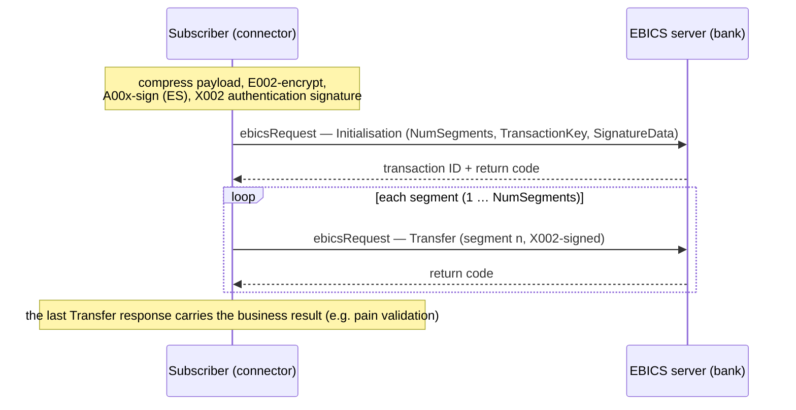

# Connector: Upload API (CCT / CDD / CDB / CIP …)

> Implementation of **issue #48** (milestone M6 — Connector). This page describes the client-side
> upload API of the `EBICO.Connector`: the generic upload method, the SEPA convenience requests, the
> client-side crypto pipeline (compress → E002 encrypt → electronic signature → segment → X002
> authentication signature) and the two-phase upload transaction. The basis is the
> [client core](client-core.md) (#46) and the completed [onboarding](onboarding.md) (#47);
> the overall design is in the [Connector architecture](architecture.md).

## Purpose

After completed onboarding (INI/HIA/HPB and activation by the bank) a subscriber can upload business
orders. The upload API takes a payload (e.g. a SEPA `pain` message), prepares it cryptographically on
the client side and transfers it in the EBICS upload transaction consisting of two phases:
**Initialisation** (order metadata, encrypted transaction key, signature) and **Transfer** (the order
data segment by segment).

The counterpart is the emulator: the
[upload transaction](../server/upload-transaction.md) (#32) and the
[payment order processing](../server/payment-orders.md) (#39) process CCT/CDD/CDB/CIP on the server
side. This API is the **inverse** flow.


```mermaid
sequenceDiagram
    participant C as Subscriber (connector)
    participant S as EBICS server (bank)
    Note over C: compress payload, E002-encrypt,<br/>A00x-sign (ES), X002 authentication signature
    C->>S: ebicsRequest — Initialisation (NumSegments, TransactionKey, SignatureData)
    S-->>C: transaction ID + return code
    loop each segment (1 … NumSegments)
        C->>S: ebicsRequest — Transfer (segment n, X002-signed)
        S-->>C: return code
    end
    Note over C: the last Transfer response carries the business result (e.g. pain validation)
```

## Public API

```csharp
services.AddEbicoConnector(o => { /* Url, HostId, PartnerId, UserId, Version */ })
        .Services.AddEbicoUpload();
```

### Convenience requests (SEPA payments)

For the common SEPA orders a descriptive request suffices; the order type is fixed:

```csharp
var client = provider.GetRequiredService<IEbicsClient>();

// SEPA Credit Transfer (CCT, pain.001)
EbicsResult<UploadResult> result = await client.Send(new CctUploadRequest { Pain001 = painBytes });

if (result.IsSuccess)
{
    Console.WriteLine($"Transaktion {result.Value!.TransactionId}, {result.Value.NumSegments} Segment(e)");
}
else
{
    Console.WriteLine($"Abgelehnt: {result.ReturnCode} {result.ReturnText}");
}
```

| Request | Order type | Message |
| --- | --- | --- |
| `CctUploadRequest` | `CCT` — SEPA Credit Transfer | `pain.001` |
| `CddUploadRequest` | `CDD` — SEPA Direct Debit (CORE) | `pain.008` |
| `CdbUploadRequest` | `CDB` — SEPA Direct Debit (B2B) | `pain.008` |
| `CipUploadRequest` | `CIP` — SEPA Instant Credit Transfer | `pain.001` |

### Generic upload method

For other order types or fine control, `UploadRequest` serves:

```csharp
// H005 über eine BTF …
await client.Send(new UploadRequest
{
    OrderData = painBytes,
    Btf = new BusinessTransactionFormat("SCT", messageName: "pain.001"),
});

// … oder über einen klassischen Order-Typ (H003/H004 direkt; H005 leitet die BTF daraus ab)
await client.Send(new UploadRequest { OrderData = painBytes, OrderType = "CCT" });

// … oder generisch als FUL mit FileFormat (nur H003/H004)
await client.Send(new UploadRequest { OrderData = painBytes, FileFormat = "pain.001.001.09" });
```

`MaxSegmentSizeBytes` controls the (raw, pre-Base64) segment size; without a value the shared
default `EbicsSegmentation.DefaultSegmentSizeBytes` (**512 KiB**) applies, which
`EbicoServerOptions.SegmentSizeBytes` also refers to. The result is always an
`EbicsResult<UploadResult>` with the hex-encoded `TransactionId` and the segment count.

> **Think along when raising it (#124):** A segment travels base64-encoded (factor 4/3) *together with
> its envelope* in one HTTP body. Whoever raises the segment size must keep an eye on the body limit of
> the counterpart — otherwise it responds with **HTTP 413**, i.e. a transport exception in the middle
> of the transaction instead of an EBICS return code.
> `EbicsSegmentation.MaxSegmentSizeForRequestBody(limit)` derives the largest safe value. Exactly this
> coordination was missing up to #124: the default sat at 768 KiB, whose base64 form fills the
> emulator's 1-MiB limit exactly
> ([segmentation](../server/segmentation.md#the-default-is-shared-124)).

`DistributedSignature = true` asks the bank to park the order for the **distributed electronic
signature** instead of executing it (H005 `SignatureFlag`, H003/H004 `OrderAttribute=OZHNN`).
The further flow — signing, cancelling, overview — is in [Connector: VEU](veu.md).

## Flow (client-side)

The `UploadExecutor` orchestrates per `Send`:

1. **Compress** — `EbicsCompression.Compress` (zlib).
2. **Transaction key** — `EncryptionE002.GenerateTransactionKey` (one-time AES-128).
3. **Encrypt key** — `EncryptionE002.EncryptTransactionKey` (RSA-OAEP for the
   **bank E002 key** from the `IKeyStore`; requires HPB to have run).
4. **Encrypt order data** — `EncryptionE002.EncryptOrderData` (AES-128-CBC under the
   transaction key).
5. **Electronic signature (ES)** — `BankSignature.Sign` (A00x) over the order data, wrapped into a
   version-dependent `UserSignatureData` (`S001` for H003/H004, `S002` for H005), then compressed and
   encrypted with the same transaction key (`DataTransfer/SignatureData`).
6. **Segment** — `EbicsSegmentation.Split` divides the ciphertext into `NumSegments` segments.
7. **Initialisation** — version-dependent `ebicsRequest` with `NumSegments`, `DataEncryptionInfo`
   (encrypted transaction key + bank key fingerprint) and `SignatureData`; serialized unsigned, then
   the **X002 authentication signature** (`AuthenticationSignature.Sign`) is set.
8. **Take over the transaction ID** from the response (error return code → `EbicsResult.Failure`).
9. **Transfer** — one X002-signed `ebicsRequest` per segment; the **last** response carries the
   business result (e.g. `090004` for an invalid pain).
10. **Result** — `EbicsResult.Success(UploadResult)`.

Reused Core primitives:
[`EbicsCompression`](../server/segmentation.md), [`EncryptionE002`](../protocol/encryption-e002.md),
[`BankSignature`](../protocol/bank-signature.md),
[`AuthenticationSignature`](../protocol/auth-signature-x002.md),
[`EbicsSegmentation`](../server/segmentation.md), `PublicKeyFingerprint`, `KeyVersions`,
[`BtfOrderTypeCatalog`](../server/btf-framework.md).

## Version dispatch

The three submission conventions (compatible with
[`BtfOrderTypeCatalog.ResolveUploadOrderType`](../server/payment-orders.md)) are mapped via one
envelope builder per version behind a registry (same pattern as with onboarding):

| Version | Order details |
| --- | --- |
| **H005** | `AdminOrderType = "BTU"` + `BTUOrderParams/Service` (BTF); the BTF is resolved from the order type if not set directly |
| **H003 / H004** | classic `OrderType` (e.g. `CCT`) directly, or `FUL` + `FULOrderParams/FileFormat`; `OrderAttribute = DZHNN` (not `OZHNN` = distributed signature) |

## Error handling

- **Business return codes** (e.g. `090003` no authorisation, `090004` invalid pain, `091101`
  unknown transaction ID) end up in `EbicsResult.Failure(ReturnCode, ReturnText)`.
- **Technical/configuration errors** throw: missing bank E002 key (HPB not run) or
  missing subscriber keys → `EbicsConfigurationException`; transport errors →
  `EbicsTransportException`.

## Tests

`tests/EBICO.Tests/Connector/Upload/` checks across all three versions (H003/H004/H005):
happy-path **round-trip** (the test decodes the sent bytes exactly like the server —
reassemble → E002 decrypt → decompress — and compares against the original payload),
**multi-segment** uploads, the correct order identity of the convenience requests (order type or
H005 BTF) as well as the negative cases (init `090003`, transfer `090004`, `091101`, missing bank
key). The server responses are built by a tier-A fake with the real `EbicsResponseFactory`.

## Spec caveats

- The **ES** is sent along but (not yet) **verified** on the server side
  (see [upload transaction](../server/upload-transaction.md)); order data and ES share —
  spec-compliant — the same transaction key.
- The server's **X002 response signature** is not checked (the server answers unsigned, M4).
- The exact segment size/base64 limit, the `SecurityMedium` (`"0000"`) and the
  `OrderAttribute` choice need to be verified against the official EBICS annexes.

## Related docs

- [Connector architecture](architecture.md) — send pipeline, transaction skeleton
- [Client core & configuration](client-core.md) — #46: dispatch, options/DI, transport, key store
- [Onboarding flows INI / HIA / HPB](onboarding.md) — #47: prerequisite (bank E002 key)
- [E2E: Connector ↔ Server](../development/e2e-connector-server.md) — #57: CCT as a real round-trip against the server (instead of against `FakeUploadServer`)
- [Server: upload transaction](../server/upload-transaction.md) — the counterpart (#32)
- [Server: payment orders](../server/payment-orders.md) — CCT/CDD/CDB/CIP processing (#39)
- [Encryption E002](../protocol/encryption-e002.md) · [Bank-technical signature A005/A006](../protocol/bank-signature.md) · [Authentication signature X002](../protocol/auth-signature-x002.md)

---

> This page is the maintained reference. On changes to the upload API, update it here (and in the
> [doc index](../index.md)).
