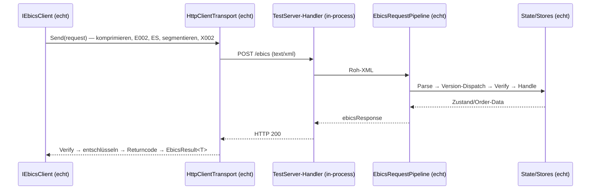

# E2E: Connector ↔ Server — Happy Paths

> Umsetzung von **Issue #57** (Milestone M8 — Validation & Conformance). Diese Seite beschreibt den
> ersten Testaufbau, in dem `EBICO.Connector` und `EBICO.Server` **direkt miteinander** sprechen.
>
> Bewusst **enthalten**: INI/HIA/HPB, Upload **CCT**, Download **C53** — je **H003/H004/H005**,
> gegen den in-process gehosteten Emulator; drei Negativfälle, die genau an dieser Nahtstelle
> entstehen (Reihenfolge, Berechtigung, ungültige Nutzdaten).
>
> Seit **Issue #58** prüft der Server die Authentifikationssignatur X002; die breiten Negativ-/
> Sicherheitsfälle liegen in [Negativ- & Sicherheitsfälle](negative-security-cases.md). Bewusst
> **noch nicht**: reale Fremd-Clients (Issue #59), Signatur der Server-Antworten.

## Zweck

Beide Seiten waren bis M8 **gut getestet — aber nur gegen ein Modell der jeweils anderen**:

- Die Connector-Tests (`OnboardingTestHarness`, `UploadTestHarness`, `DownloadTestHarness`) antworten
  mit selbst gebauten Bank-Antworten (Tier-A-Fakes).
- Die Server-Tests bauen ihr Request-XML von Hand (`ServerTestHelpers`).

Eine Annahme über das Wire-Format, die **beide Seiten konsistent, aber falsch** getroffen haben, wäre
so unsichtbar geblieben. Genau diese Lücke schließt #57: der echte Connector-Pipeline spricht das
echte EBICS-Wire-Format gegen die echte Server-Pipeline.



## Aufbau

`tests/EBICO.Tests/E2E/EbicsE2EHarness.cs` verdrahtet beide Seiten:

**Host.** `WebApplicationFactory<Program>` hostet den Server in-process. `Program` ist in
`EBICO.Server` bewusst als `public partial class Program;` deklariert; weil `EBICO.Suite` ebenfalls
ein `Program` hat, trägt die ProjectReference im Testprojekt `Aliases="global,EbicoServer"` — daher
`extern alias EbicoServer;` als **erste Zeile** jeder Datei und
`using ServerProgram = EbicoServer::Program;`.

**Transport.** `AddEbicoConnector(…)` liefert einen `IHttpClientBuilder` zurück; daran hängt
`.ConfigurePrimaryHttpMessageHandler(() => factory.Server.CreateHandler())`. Damit bleibt der
**echte** `HttpClientTransport` im Spiel — nur der unterste Handler zeigt auf den Testhost.

> ⚠️ **Stolperstein:** `HttpClientTransport` postet gegen die **absolute** `EbicsConnection.Url`, nicht
> gegen die `BaseAddress` des `HttpClient`. Die URL muss daher `http://localhost` + `EndpointPath`
> lauten (`http://localhost/ebics`).

Die Verdrahtung im Kern (aus `EbicsE2EHarness.CreateAsync`):

```csharp
var services = new ServiceCollection();
services.AddEbicoConnector(o =>
    {
        // HttpClientTransport postet gegen die absolute Url, nicht gegen BaseAddress:
        // Testhost-Origin + EbicoServerOptions.EndpointPath.
        o.Url = "http://localhost/ebics";
        o.HostId = hostId.Value;
        o.PartnerId = partnerId.Value;
        o.UserId = userId.Value;
        o.Version = version; // H003 | H004 | H005
    })
    // Der echte HttpClientTransport bleibt im Spiel — nur der unterste Handler zeigt auf den Testhost.
    .ConfigurePrimaryHttpMessageHandler(() => factory.Server.CreateHandler());
services.AddEbicoOnboarding();
services.AddEbicoUpload();
services.AddEbicoDownload();
```

**Schlüssel (`E2EKeyPool`).** RSA-Generierung dominiert die Laufzeit, und
`RsaKeyMaterial.MinKeySizeBits` (2048) ist eine **harte Untergrenze** — der Konstruktor lehnt kleinere
Schlüssel ab. Der einzige Hebel ist deshalb **Wiederverwendung, nicht Verkleinerung**: der Pool erzeugt
je Zweck einen Schlüssel pro Testlauf. Die Onboarding-Tests umgehen den Pool bewusst und treiben den
echten `ISubscriberKeyGenerator` — dort *ist* die Schlüsselgenerierung Prüfgegenstand. Überall sonst ist
Onboarding nur Voraussetzung; INI/HIA/HPB laufen trotzdem echt über HTTP, es werden lediglich die
Schlüssel vorbelegt.

**Isolation.** Je Test eine eigene **HostID**, kein eigener Host. Alle Server-Stores sind über `HostId`
bzw. `SubscriberKeyRef` verschlüsselt, eine eigene HostID isoliert also so wirksam wie ein frischer Host
(das `WithWebHostBuilder(_ => { })`-Idiom der Server-Tests) — ohne zweiten Host-Boot. IDs dürfen nur
`[a-zA-Z0-9,=]` enthalten (keine Bindestriche/Unterstriche, max. 35 Zeichen).

**Zustand.** Der Teilnehmer wird bewusst im Zustand **`New`** geseedet: das echte INI treibt
`New → Initialized`, das echte HIA `Initialized → Ready`. Ein Vorab-Übergang (wie ihn die
Einzelschicht-Server-Tests machen) würde genau den Lebenszyklus überspringen, den dieser Test belegen
soll. Das Bankschlüsselpaar wird über `IServerBankKeyStore.SetAsync` geseedet — das spart zwei
RSA-Generierungen je Test und macht die HPB-Fingerprints vorab bekannt.

## Abgedeckte Abläufe

| Ablauf | H003 | H004 | H005 | Kernassertion |
| --- | :---: | :---: | :---: | --- |
| INI/HIA/HPB | ✅ | ✅ | ✅ | `New → Initialized → Ready`, Fingerprint-Abgleich, `FingerprintsVerified` |
| Upload CCT | ✅ | ✅ | ✅ | Server rekonstruiert die pain.001-Bytes, `EffectiveOrderType == "CCT"` |
| Download C53 | ✅ | ✅ | ✅ | camt.053 im ZIP, Receipt → `011000` |

7 Theories × 3 Versionen = **21 Round-Trips**.

Zwei Assertions tragen die Suite:

- **`HpbResult.FingerprintsVerified`** — wahr nur, wenn der Connector die E002-Nutzdaten entschlüsselt
  hat *und* die enthaltenen Bankschlüssel exakt die geseedeten sind (eine Abweichung wirft
  `EbicsOnboardingException`). Das schließt die Schleife Komprimieren → E002 → Wire → Entschlüsseln.
- **`UploadTransaction.EffectiveOrderType == "CCT"`** — die Nahtstelle, die keine Einzelschicht prüfen
  kann: H003/H004 senden `OrderType="CCT"` direkt, H005 `AdminOrderType="BTU"` + BTF (`SCT`/`pain.001`);
  beide müssen serverseitig auf denselben klassischen Code auflösen
  (`BtfOrderTypeCatalog.ResolveUploadOrderType`).

## Returncodes & Fehlerfälle

| Situation | Returncode |
| --- | --- |
| INI/HIA/HPB, Upload CCT erfolgreich | `000000` `EBICS_OK` |
| Download C53 erfolgreich | **`011000`** `EBICS_DOWNLOAD_POSTPROCESS_DONE` |
| HIA/HPB vor INI (Statusmaschine) | `091002` `EBICS_INVALID_USER_OR_USER_STATE` |
| CCT ohne Berechtigung | `090003` `EBICS_AUTHORISATION_ORDER_TYPE_FAILED` |
| C53 ohne Berechtigung | `090003` `EBICS_AUTHORISATION_ORDER_TYPE_FAILED` |
| CCT mit ungültiger pain.001 | `090004` `EBICS_INVALID_ORDER_DATA_FORMAT` |

> ⚠️ **`011000`, nicht `000000`.** Ein erfolgreicher Download endet mit dem Code des **positiven
> Receipts**: beim Kombinieren der Returncodes gewinnt der Nicht-OK-Slot. `EbicsResult.IsSuccess` ist
> trotzdem `true`.

Die Negativfälle sind bewusst auf vier begrenzt — es sind jene, die **erst an dieser Nahtstelle**
entstehen. Breite Negativ-/Sicherheitsfälle gehören zu Issue #58, Konformität gegen reale Clients zu
Issue #59.

### ⚠️ Spec-Vorbehalte

- **X002 wird seit #58 serverseitig geprüft; Antworten bleiben unsigniert.** Der Server verifiziert
  die X002-Signatur jedes signierten `ebicsRequest` (`X002EbicsRequestVerifier`, siehe
  [Negativ- & Sicherheitsfälle](negative-security-cases.md)) — diese Happy-Path-E2E belegen damit
  auch den Sign→Verify-Roundtrip Connector→Server. Der Server signiert seine **Antworten** weiterhin
  nicht, und der Connector prüft umgekehrt keine Antwortsignatur (offener Vorbehalt M4/M6).
- **ES/A00x ungeprüft.** Die banktechnische Signatur der Order-Data wird serverseitig nicht verifiziert.
- **C53-Daten sind synthetisch.** Der Server generiert den Auszug bei Bedarf
  (`StatementDownloadProcessor`); es ist kein reales Bankdatenmaterial.
- **Die Gegenstelle ist der Emulator, nicht ein realer Client.** Ein grüner E2E belegt Konsistenz
  zwischen EBICO-Connector und EBICO-Server — nicht Spec-Konformität. Das ist Gegenstand von
  [#59 (Konformität gegen reale Clients)](conformance-real-clients.md) — der dort dokumentierte
  `xsi:type`-Fund zeigt genau eine solche geteilte Annahme, die ein realer Client nicht teilt.

## EBICS-Versionsbezug

| Aspekt | H003 / H004 | H005 |
| --- | --- | --- |
| Auftragstyp Upload | `OrderType="CCT"` | `AdminOrderType="BTU"` + BTF (`SCT`/`pain.001`) |
| Auftragstyp Download | `OrderType="C53"` | `AdminOrderType="BTD"` + BTF (`EOP`/`camt.053`/`Zip`) |
| Schlüssel im Onboarding | `RSAKeyValue` | X.509 (`X509Data`, self-signed je Antwort) |
| Berechtigung | `CCT` / `C53` | `CCT` / `C53` (identisch) |

**Ein** Berechtigungssatz (`CCT`/`C53`) deckt alle drei Versionen ab: der Server autorisiert gegen den
*aufgelösten* klassischen Code, nicht gegen den Wire-Identifier `BTU`/`BTD`/`FUL`/`FDL`. Genau das
prüfen `CctUpload_WithoutPermission_IsRejected` und `C53Download_WithoutPermission_IsRejected` für jede
Version (beide erwarten `090003` `EBICS_AUTHORISATION_ORDER_TYPE_FAILED`).

Konkret unterscheiden sich die `OrderDetails` im `ebicsRequest` genau an dieser Stelle — hier für den
CCT-Upload (vereinfachte Fragmente; Signatur, `DataEncryptionInfo` und Namespaces weggelassen):

```xml
<!-- H003/H004: klassischer Auftragstyp direkt (CctUploadRequest -> OrderType="CCT") -->
<static>
  <OrderDetails>
    <OrderType>CCT</OrderType>
    <OrderAttribute>DZHNN</OrderAttribute>
  </OrderDetails>
</static>
```

```xml
<!-- H005: generischer BTU-Upload, die BTF (SCT/pain.001) trägt die Geschäftsidentität -->
<static>
  <OrderDetails>
    <AdminOrderType>BTU</AdminOrderType>
    <BTUOrderParams>
      <Service>
        <ServiceName>SCT</ServiceName>
        <MsgName>pain.001</MsgName>
      </Service>
    </BTUOrderParams>
  </OrderDetails>
</static>
```

Der Server löst beide Konventionen über `BtfOrderTypeCatalog.ResolveUploadOrderType` auf denselben
klassischen Code `CCT` auf — dagegen läuft dann Autorisierung und Verarbeitung.

## Tests

`tests/EBICO.Tests/E2E/` (xUnit v3 + AwesomeAssertions; Tier-A: alles in-process erzeugt, keine
proprietären Fixtures):

- `EbicsE2EHarness` — `E2EKeyPool`, Harness (Seeding + DI-Verdrahtung), `E2EOnboardingResults`.
- `OnboardingE2ETests` — `[Theory]` über H003/H004/H005: Happy Path mit echter Schlüsselgenerierung
  (Zustandsübergänge, Fingerprint-Abgleich gegen den `IServerKeyStore`, `FingerprintsVerified`,
  Bankschlüssel im Connector-`IKeyStore`) plus Negativfall Reihenfolge (`091002`).
- `UploadE2ETests` — Happy Path mit serverseitiger Rückgewinnung der pain.001-Bytes und
  `EffectiveOrderType`-Prüfung; Negativfälle Berechtigung (`090003`) und ungültige pain.001 (`090004`).
- `DownloadE2ETests` — Happy Path camt.053-im-ZIP über den `Parse`-Hook (läuft **vor** dem Receipt) und
  Receipt-Returncode `011000`; Negativfall Berechtigung (`090003`).

Laufzeit: 21 Round-Trips in ≈1 s (drei Testklassen laufen als eigene xUnit-Collections parallel).

## Verwandte Doku

- [Test-Harness & Fixtures](testing.md) — Framework, Helfer, Tier A/B
- [Onboarding-Flows INI / HIA / HPB](../connector/onboarding.md)
- [Upload-API (CCT/CDD/CDB/CIP)](../connector/upload.md)
- [Download-API (STA/C53/VMK/C52/C54 …)](../connector/download.md)
- [Hostable Server-Grundgerüst](../server/host.md)
- [Order-/BTF-Abdeckungsmatrix](../server/order-coverage-matrix.md)
