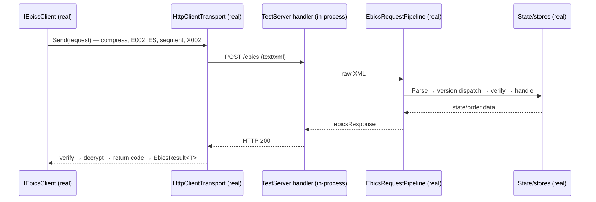

# E2E: Connector ↔ Server — Happy Paths

> Implementation of **issue #57** (Milestone M8 — Validation & Conformance). This page describes the
> first test setup in which `EBICO.Connector` and `EBICO.Server` talk **directly to each other**.
>
> Deliberately **included**: INI/HIA/HPB, upload **CCT**, download **C53** — each in **H003/H004/H005**,
> against the in-process hosted emulator; three negative cases that arise precisely at this seam
> (order, authorisation, invalid payload).
>
> Since **issue #58** the server verifies the X002 authentication signature; the broad negative/
> security cases are in [Negative & security cases](negative-security-cases.md). Deliberately
> **not yet**: real third-party clients (issue #59), signature of the server responses.

## Purpose

Until M8 both sides were **well tested — but only against a model of the respective other**:

- The connector tests (`OnboardingTestHarness`, `UploadTestHarness`, `DownloadTestHarness`) respond
  with self-built bank responses (Tier-A fakes).
- The server tests build their request XML by hand (`ServerTestHelpers`).

An assumption about the wire format that **both sides made consistently, but wrongly**, would
have stayed invisible this way. This is exactly the gap #57 closes: the real connector pipeline speaks the
real EBICS wire format against the real server pipeline.


```mermaid
sequenceDiagram
    participant C as IEbicsClient (real)
    participant T as HttpClientTransport (real)
    participant H as TestServer handler (in-process)
    participant P as EbicsRequestPipeline (real)
    participant S as State/stores (real)

    C->>T: Send(request) — compress, E002, ES, segment, X002
    T->>H: POST /ebics (text/xml)
    H->>P: raw XML
    P->>S: Parse → version dispatch → verify → handle
    S-->>P: state/order data
    P-->>H: ebicsResponse
    H-->>T: HTTP 200
    T-->>C: verify → decrypt → return code → EbicsResult<T>
```

## Setup

`tests/EBICO.Tests/E2E/EbicsE2EHarness.cs` wires both sides together:

**Host.** `WebApplicationFactory<Program>` hosts the server in-process. `Program` is
deliberately declared in `EBICO.Server` as `public partial class Program;`; because `EBICO.Suite` also
has a `Program`, the ProjectReference in the test project carries `Aliases="global,EbicoServer"` — hence
`extern alias EbicoServer;` as the **first line** of every file and
`using ServerProgram = EbicoServer::Program;`.

**Transport.** `AddEbicoConnector(…)` returns an `IHttpClientBuilder`; onto it hangs
`.ConfigurePrimaryHttpMessageHandler(() => factory.Server.CreateHandler())`. This keeps the
**real** `HttpClientTransport` in play — only the lowest handler points at the test host.

> ⚠️ **Pitfall:** `HttpClientTransport` posts against the **absolute** `EbicsConnection.Url`, not
> against the `BaseAddress` of the `HttpClient`. The URL must therefore be `http://localhost` + `EndpointPath`
> (`http://localhost/ebics`).

The wiring at its core (from `EbicsE2EHarness.CreateAsync`):

```csharp
var services = new ServiceCollection();
services.AddEbicoConnector(o =>
    {
        // HttpClientTransport postet gegen die absolute Url, nicht gegen BaseAddress:
        // Testhost-Origin + EbicoServerOptions.EndpointPath.
        o.Url = "http://localhost/ebics";
        o.HostId = hostId.Value;
        o.PartnerId = partnerId.Value;
        o.UserId = userId.Value;
        o.Version = version; // H003 | H004 | H005
    })
    // Der echte HttpClientTransport bleibt im Spiel — nur der unterste Handler zeigt auf den Testhost.
    .ConfigurePrimaryHttpMessageHandler(() => factory.Server.CreateHandler());
services.AddEbicoOnboarding();
services.AddEbicoUpload();
services.AddEbicoDownload();
```

**Keys (`E2EKeyPool`).** RSA generation dominates the runtime, and
`RsaKeyMaterial.MinKeySizeBits` (2048) is a **hard lower bound** — the constructor rejects smaller
keys. The only lever is therefore **reuse, not shrinking**: the pool creates
one key per purpose per test run. The onboarding tests deliberately bypass the pool and drive the
real `ISubscriberKeyGenerator` — there key generation *is* the subject under test. Everywhere else,
onboarding is only a precondition; INI/HIA/HPB still run for real over HTTP, only the
keys are prepopulated.

**Isolation.** Each test gets its own **HostID**, not its own host. All server stores are encrypted via `HostId`
or `SubscriberKeyRef`, so a dedicated HostID isolates as effectively as a fresh host
(the `WithWebHostBuilder(_ => { })` idiom of the server tests) — without a second host boot. IDs may only
contain `[a-zA-Z0-9,=]` (no hyphens/underscores, max. 35 characters).

**State.** The subscriber is deliberately seeded in state **`New`**: the real INI drives
`New → Initialized`, the real HIA `Initialized → Ready`. A pre-transition (as done by the
single-layer server tests) would skip exactly the lifecycle this test is meant to prove.
The bank key pair is seeded via `IServerBankKeyStore.SetAsync` — this saves two
RSA generations per test and makes the HPB fingerprints known in advance.

## Covered flows

| Flow | H003 | H004 | H005 | Core assertion |
| --- | :---: | :---: | :---: | --- |
| INI/HIA/HPB | ✅ | ✅ | ✅ | `New → Initialized → Ready`, fingerprint match, `FingerprintsVerified` |
| Upload CCT | ✅ | ✅ | ✅ | Server reconstructs the pain.001 bytes, `EffectiveOrderType == "CCT"` |
| Upload CCT **across multiple segments** | ✅ | ✅ | ✅ | with the **shipped** defaults, `NumSegments > 1`, bytes identical (#124) |
| Download C53 | ✅ | ✅ | ✅ | camt.053 in the ZIP, receipt → `011000` |
| VEU: park → HVU → HVE/HVS → release | ✅ | ✅ | ✅ | own suite, see [Connector: VEU](../connector/veu.md) (#124) |

### The single-segment gap (#124)

Until #124 **every** upload test ran in exactly one segment — `UploadE2ETests` even checked it explicitly
(`NumSegments == 1`). This left the coupling between the connector's segment size and the
server's body limit untested, although both values were covered individually: the connector default
(768 KiB) produced base64 of exactly 1 MiB and thus requests that the server default (1 MiB body) **always**
had to reject with HTTP 413. The new test closes exactly this seam.

For it to hold, its payload is deliberately **incompressible** (base64 noise in the creditor names,
`PainSamples.IncompressibleCreditTransfer`): an ordinary pain.001 is so repetitive that even
ten megabytes deflate to a single segment — a "large" test case would therefore not have hit the gap
at all.

Two assertions carry the suite:

- **`HpbResult.FingerprintsVerified`** — true only if the connector has decrypted the E002 payload
  *and* the contained bank keys are exactly the seeded ones (a deviation throws
  `EbicsOnboardingException`). This closes the loop compress → E002 → wire → decrypt.
- **`UploadTransaction.EffectiveOrderType == "CCT"`** — the seam that no single layer can check:
  H003/H004 send `OrderType="CCT"` directly, H005 `AdminOrderType="BTU"` + BTF (`SCT`/`pain.001`);
  both must resolve server-side to the same classic code
  (`BtfOrderTypeCatalog.ResolveUploadOrderType`).

## Return codes & error cases

| Situation | Return code |
| --- | --- |
| INI/HIA/HPB, upload CCT successful | `000000` `EBICS_OK` |
| Download C53 successful | **`011000`** `EBICS_DOWNLOAD_POSTPROCESS_DONE` |
| HIA/HPB before INI (state machine) | `091002` `EBICS_INVALID_USER_OR_USER_STATE` |
| CCT without authorisation | `090003` `EBICS_AUTHORISATION_ORDER_TYPE_FAILED` |
| C53 without authorisation | `090003` `EBICS_AUTHORISATION_ORDER_TYPE_FAILED` |
| CCT with invalid pain.001 | `090004` `EBICS_INVALID_ORDER_DATA_FORMAT` |

> ⚠️ **`011000`, not `000000`.** A successful download ends with the code of the **positive
> receipt**: when combining the return codes the non-OK slot wins. `EbicsResult.IsSuccess` is
> nonetheless `true`.

The negative cases are deliberately limited to four — they are those that arise **only at this seam**.
Broad negative/security cases belong to issue #58, conformance against real clients to
issue #59.

### ⚠️ Spec caveats

- **X002 has been checked server-side since #58; responses remain unsigned.** The server verifies
  the X002 signature of every signed `ebicsRequest` (`X002EbicsRequestVerifier`, see
  [Negative & security cases](negative-security-cases.md)) — these happy-path E2E tests thereby also
  evidence the sign→verify roundtrip connector→server. The server still does not sign its **responses**,
  and the connector conversely checks no response signature (open caveat M4/M6).
- **ES/A00x unchecked.** The bank-technical signature of the order data is not verified server-side.
- **C53 data is synthetic.** The server generates the statement on demand
  (`StatementDownloadProcessor`); it is no real bank data material.
- **The counterpart is the emulator, not a real client.** A green E2E evidences consistency
  between EBICO connector and EBICO server — not spec conformance. That is the subject of
  [#59 (conformance against real clients)](conformance-real-clients.md) — the `xsi:type`
  finding documented there shows exactly such a shared assumption that a real client does not share.

## EBICS version reference

| Aspect | H003 / H004 | H005 |
| --- | --- | --- |
| Upload order type | `OrderType="CCT"` | `AdminOrderType="BTU"` + BTF (`SCT`/`pain.001`) |
| Download order type | `OrderType="C53"` | `AdminOrderType="BTD"` + BTF (`EOP`/`camt.053`/`Zip`) |
| Keys in onboarding | `RSAKeyValue` | X.509 (`X509Data`, self-signed per response) |
| Authorisation | `CCT` / `C53` | `CCT` / `C53` (identical) |

**One** authorisation set (`CCT`/`C53`) covers all three versions: the server authorises against the
*resolved* classic code, not against the wire identifier `BTU`/`BTD`/`FUL`/`FDL`. Exactly this is
checked by `CctUpload_WithoutPermission_IsRejected` and `C53Download_WithoutPermission_IsRejected` for each
version (both expect `090003` `EBICS_AUTHORISATION_ORDER_TYPE_FAILED`).

Concretely, the `OrderDetails` in the `ebicsRequest` differ at exactly this point — here for the
CCT upload (simplified fragments; signature, `DataEncryptionInfo` and namespaces omitted):

```xml
<!-- H003/H004: klassischer Auftragstyp direkt (CctUploadRequest -> OrderType="CCT") -->
<static>
  <OrderDetails>
    <OrderType>CCT</OrderType>
    <OrderAttribute>DZHNN</OrderAttribute>
  </OrderDetails>
</static>
```

```xml
<!-- H005: generischer BTU-Upload, die BTF (SCT/pain.001) trägt die Geschäftsidentität -->
<static>
  <OrderDetails>
    <AdminOrderType>BTU</AdminOrderType>
    <BTUOrderParams>
      <Service>
        <ServiceName>SCT</ServiceName>
        <MsgName>pain.001</MsgName>
      </Service>
    </BTUOrderParams>
  </OrderDetails>
</static>
```

The server resolves both conventions via `BtfOrderTypeCatalog.ResolveUploadOrderType` to the same
classic code `CCT` — authorisation and processing then run against that.

## Tests

`tests/EBICO.Tests/E2E/` (xUnit v3 + AwesomeAssertions; Tier A: everything generated in-process, no
proprietary fixtures):

- `EbicsE2EHarness` — `E2EKeyPool`, harness (seeding + DI wiring), `E2EOnboardingResults`.
- `OnboardingE2ETests` — `[Theory]` over H003/H004/H005: happy path with real key generation
  (state transitions, fingerprint match against the `IServerKeyStore`, `FingerprintsVerified`,
  bank keys in the connector `IKeyStore`) plus negative case order (`091002`).
- `UploadE2ETests` — happy path with server-side recovery of the pain.001 bytes and
  `EffectiveOrderType` check; negative cases authorisation (`090003`) and invalid pain.001 (`090004`).
- `DownloadE2ETests` — happy path camt.053-in-ZIP via the `Parse` hook (runs **before** the receipt) and
  receipt return code `011000`; negative case authorisation (`090003`).

Runtime: 21 round-trips in ≈1 s (three test classes run as their own xUnit collections in parallel).

## Related documentation

- [Test harness & fixtures](testing.md) — framework, helpers, Tier A/B
- [Onboarding flows INI / HIA / HPB](../connector/onboarding.md)
- [Upload API (CCT/CDD/CDB/CIP)](../connector/upload.md)
- [Download API (STA/C53/VMK/C52/C54 …)](../connector/download.md)
- [Hostable server scaffold](../server/host.md)
- [Order/BTF coverage matrix](../server/order-coverage-matrix.md)
